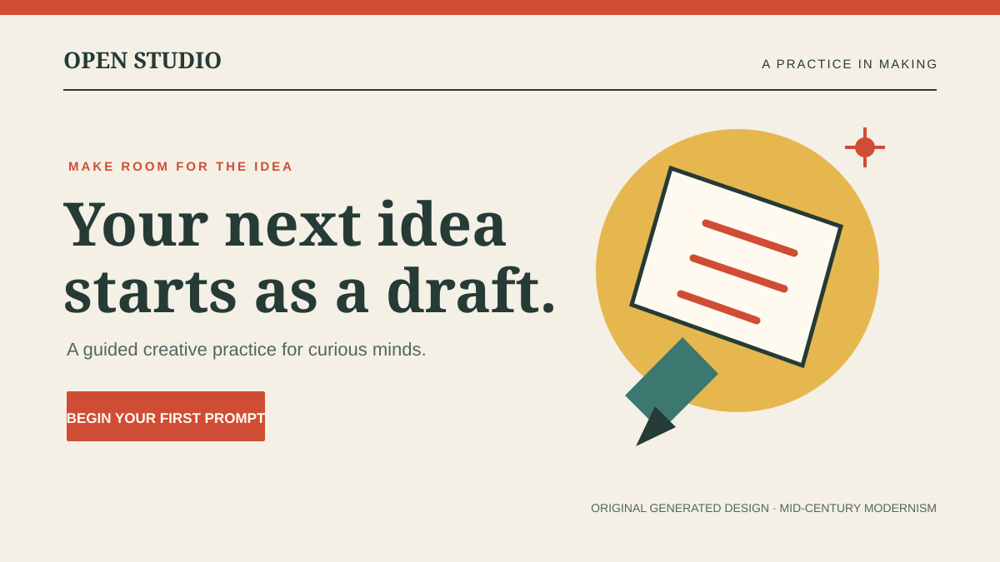
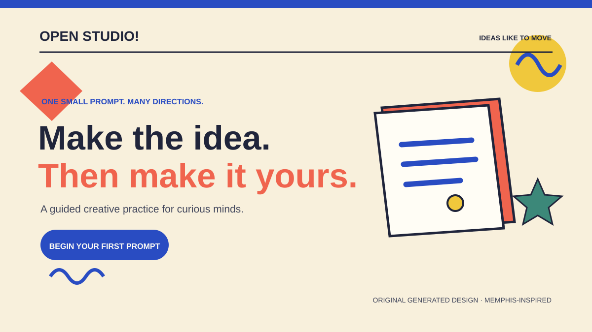

# Creator
[Archetypes](README.md) · [Hero design gallery](designs.html#creator) · [Home](../README.md)

## What is it?
The Creator archetype is driven by imagination, originality, and the urge to turn an idea into something tangible. It speaks to people who want to build, prototype, experiment, and shape work that reflects their own taste and vision. Its central fear is feeling uninspired, trapped in repetition, or unable to express an idea fully.

In brand communication, the Creator frames the offer as a tool for making and refining work. The message should emphasize process, experimentation, and personal expression rather than only the final result. The audience is invited to make something, learn through the process, and feel ownership over the outcome.

## How do you recognize or use it?
The tone is curious, expressive, and energetic. Headlines often focus on making, building, exploring, and turning ideas into experiences. Imagery may show sketches, working drafts, creative tools, prototypes, behind-the-scenes moments, interface explorations, or visible iteration. Strong contrast, layered textures, abstract shapes, and vivid accent colors can support a feeling of invention and momentum. Type is often expressive and modern, with a clear hierarchy that still leaves space for personality.

The Creator works well for audiences who value originality, experimentation, and hands-on making. Avoid presenting the offer as entirely polished or finished if the real appeal is the process itself. Show the creative path and give the audience a reason to imagine what they could make.

Commitment and consistency fits the Creator: inviting someone to begin with one small prompt gives them a concrete first step into a creative practice.

The paired hero concepts keep the same offer, Open Studio's guided creative practice, while contrasting [American Mid-Century Modernism](../modernism/american-mid-century-modernism.md) with [Memphis](../postmodernism/memphis.md).

## Examples
### Example 1: Modernist

Archetype: Creator
Style: [American Mid-Century Modernism](../modernism/american-mid-century-modernism.md)
Persuasion: Commitment and consistency
Headline: Your next idea starts as a draft.
CTA: Begin your first prompt

The restrained palette, strong typographic hierarchy, and geometric paper shapes give the creative offer a calm, purposeful frame. The low-pressure first prompt applies commitment and consistency by making it easy to start making something.

### Example 2: Postmodernist

Archetype: Creator
Style: [Memphis](../postmodernism/memphis.md)
Persuasion: Commitment and consistency
Headline: Make the idea. Then make it yours.
CTA: Begin your first prompt

The bright shapes and sketchbook illustration make experimentation visible, reinforcing the Creator's expressive character. The same first-prompt invitation keeps the offer concrete and consistent across both visual directions.

## Sources
- Margaret Mark and Carol S. Pearson, *The Hero and the Outlaw: Building Extraordinary Brands Through the Power of Archetypes*. McGraw-Hill, 2001.
- March Branding, “Brand Archetypes: The Creator.” [March Branding](https://marchbranding.com/design-insight/brand-archetypes)
- Design images: original generated vector artwork created for this project.
