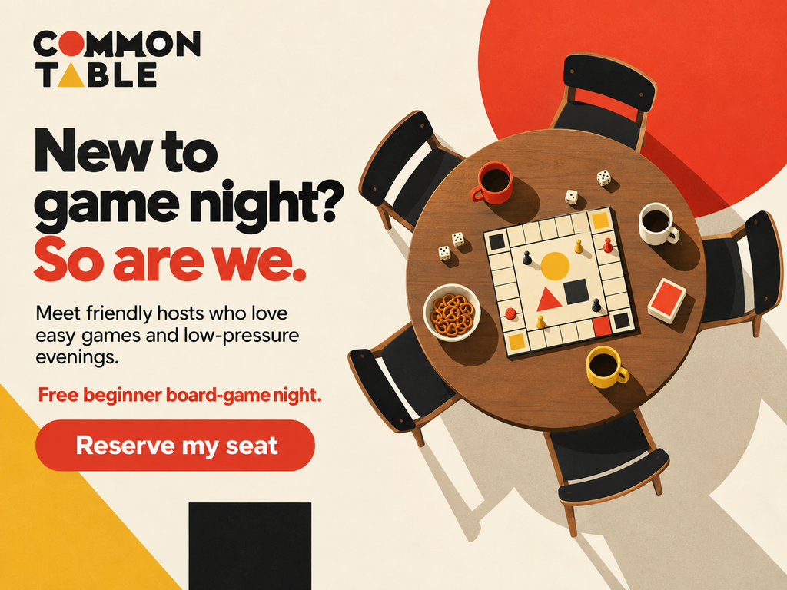
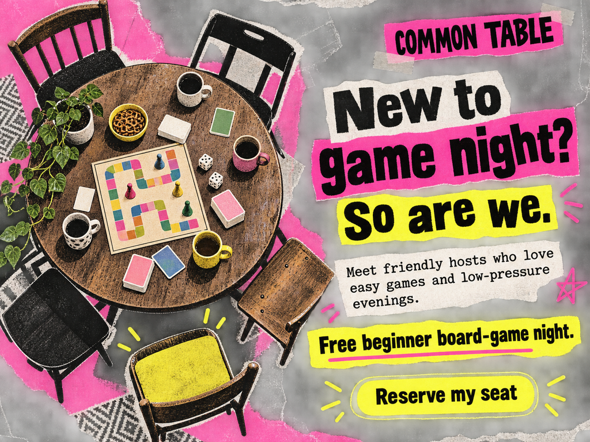
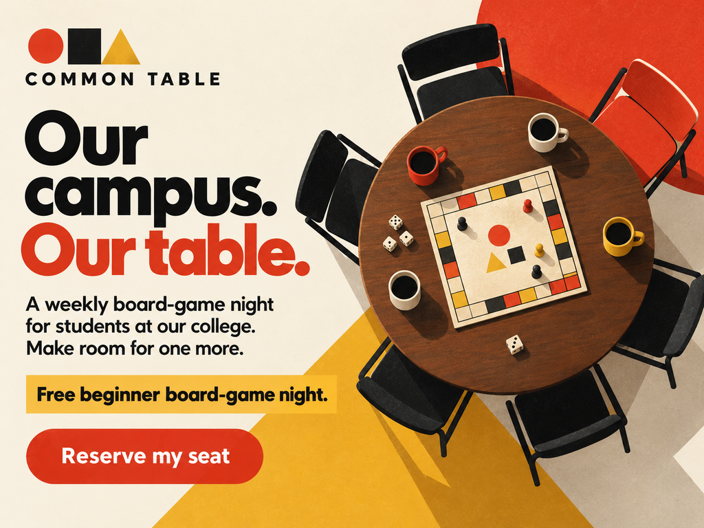
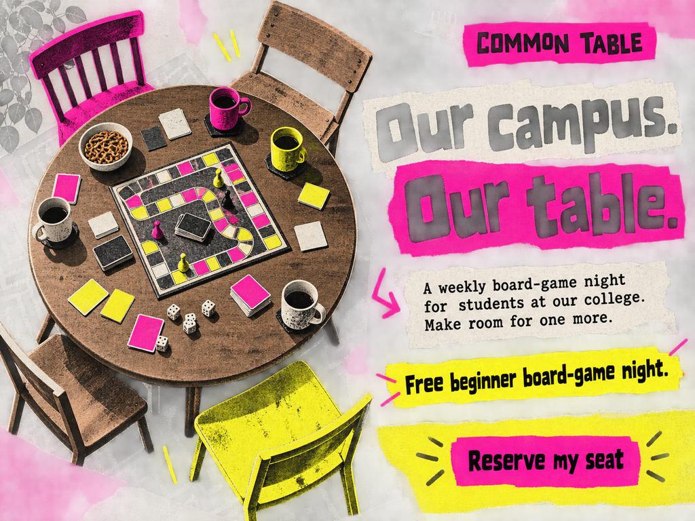
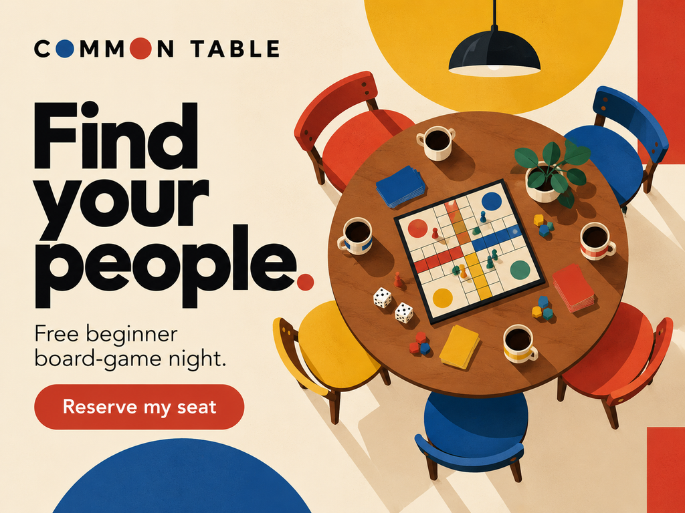

# Everyperson

[Home](../README.md) · Brennan Dahmen

## Motivation and cues

The Everyperson seeks belonging, acceptance, and an ordinary place in a group. The design should make participation feel approachable: familiar objects, plain language, an available seat, and no suggestion that expertise or status is required. Use it for community events and accessible everyday services. Avoid turning belonging into pressure to conform.

[Carol S. Pearson's Realist/Orphan description](https://carolspearson.com/archetype-pages/orphan-archetype) supports the focus on belonging and mutual support. This page uses the assignment's Everyperson label; archetype names vary across Pearson's systems.

### Real brand example

[IKEA's vision and values](https://www.ikea.com/gb/en/this-is-ikea/about-us/the-ikea-vision-and-values-pub9aa779d0/) emphasize everyday life and furnishings accessible to many people. My interpretation is that this positioning fits Everyperson because it addresses ordinary needs and broad participation. This is my archetype reading, not a claim that IKEA officially uses this label.

## Researched style references

**Bauhaus:** [Herbert Bayer, unrealized poster design for the Bauhaus Exhibition, Weimar, 1923 (MoMA)](https://www.moma.org/collection/works/220977) provides a historical reference for geometric construction. I adapt simple shapes, strong scale differences, and organized asymmetry into a clear text-and-image layout. The hero is a contemporary interpretation, not a facsimile of the drawing.

**Punk:** [V&A's Punk to Pop exhibition](https://www.vam.ac.uk/exhibitions/punk-to-pop) documents Jamie Reid's 1977 *God Save the Queen* work. Cut-and-paste lettering and visibly assembled material provide the reference for torn strips, photocopy texture, and uneven placement. This counter-design challenges polished modernist uniformity; the hero redirects the technique toward a welcoming event rather than copying the original political imagery.

## Brief

| Constant | Decision |
|---|---|
| Brand | COMMON TABLE, an original fictional concept |
| Audience | college students new to board games |
| Product and core offer | Free beginner board-game night. |
| Action | Reserve my seat |
| Modernist comparison | Bauhaus |
| Postmodern/eclectic comparison | Punk |
| Principle A / principle B | [Liking](../persuasion/liking.md) / [Unity](../persuasion/unity.md) |
| Medium and size | Generated editorial illustration; four static 1024 × 768 PNGs, displayed at 640 pixels wide |

**CTA destination:** A proposed reservation form that shows available sessions, accepts a seat request, and confirms the booking. The event is a fictional concept; no real college affiliation or scheduled session is claimed.

The brand, audience, offer, and action remain constant. Heroes 1–2 share Liking copy; heroes 3–4 share Unity copy. Style changes affect type, color, texture, and composition. These are static mockups; pictured buttons are not interactive.

## Hero 1: Bauhaus + Liking



**Headline:** New to game night? So are we.

**Supporting copy:** Meet friendly hosts who love easy games and low-pressure evenings.

**Offer:** Free beginner board-game night. **CTA:** Reserve my seat — same destination as the brief.

The empty chairs and familiar table make joining feel ordinary and low pressure, which supports Everyperson. Liking appears in the hosts' shared beginner experience and preference for easy games. The large geometric shapes and clear hierarchy adapt the Bauhaus reference linked above.

## Hero 2: Punk + Liking



**Headline:** New to game night? So are we.

**Supporting copy:** Meet friendly hosts who love easy games and low-pressure evenings.

**Offer:** Free beginner board-game night. **CTA:** Reserve my seat — same destination as the brief.

The invitation and shared-interest copy stay identical, so Liking remains the mechanism. Torn paper and bright pink/yellow panels adapt Reid's assembled Punk language, while the communal table preserves Everyperson's welcoming cue. Solid copy strips keep the rough surface from obscuring the offer.

## Hero 3: Bauhaus + Unity



**Headline:** Our campus. Our table.

**Supporting copy:** A weekly board-game night for students at our college. Make room for one more.

**Offer:** Free beginner board-game night. **CTA:** Reserve my seat — same destination as the brief.

Everyperson's belonging motive becomes explicit through the campus community and room for another student. Unity comes from the specified shared college identity, rather than simply liking the same games. The organized geometric layout keeps that identity statement and the action easy to find.

## Hero 4: Punk + Unity



**Headline:** Our campus. Our table.

**Supporting copy:** A weekly board-game night for students at our college. Make room for one more.

**Offer:** Free beginner board-game night. **CTA:** Reserve my seat — same destination as the brief.

The college identity and invitation to make room carry Unity through the Punk version. A handmade club-poster appearance supports participation without requiring a polished or expert persona. The cut-paper headline and photocopy texture adapt the same historical method used in hero 2.

## Comparison

Hero 1 is my strongest general introduction for new students: it directly acknowledges their lack of experience, explains the offer, and keeps the reservation action easy to find. Hero 3 is stronger for an established campus mailing list because the audience already shares that identity. Heroes 2 and 4 are more distinctive, but their texture competes with the table and small copy.

Style changes the reading rhythm and visual personality; persuasion changes the relationship named in the copy. Those judgments come from visual review, not conversion measurements.

## Process and rejected draft



The initial draft said “Find your people,” which suggested belonging without clearly showing either shared tastes with the hosts or an existing group identity. I changed the headline and supporting copy after my own critique showed that ambiguity. The revised Liking versions name a shared beginner experience; the Unity versions name the campus connection.

**Key prompt decisions:** Keep COMMON TABLE, the exact offer, and “Reserve my seat” across all four versions. Show inviting overhead view of a communal table with a simple generic board game, mugs, dice, and empty chairs, with space to join. No people; editorial illustration. Change only the specified style and persuasion direction, keep copy readable, and invent no testimonials, statistics, or urgency. The complete submitted prompts, including the rejected draft, are saved in [generation-prompts.json](../assets/archetype/EveryPerson/generation-prompts.json).

**Feedback status:** The revision described above is self-critique with AI assistance. A teammate's comprehension check and PR review still need to happen; none are claimed here. The earlier request for smaller images and clearer visual differences informed the 640-pixel display size and contrasting style palettes.

## Narrow-screen sketch

```text
Brand
↓
headline
↓
supporting copy
↓
free-event offer
↓
full-width reservation button
↓
cropped table illustration. Keep the empty seat visible, remove peripheral shapes, and use plain surfaces behind copy.
```

For a later website implementation, rebuild the copy as HTML text rather than shrinking the entire raster image. Preserve headline → explanation → action order, with enough space to tap the button.

## Sources and credits

Historical style and real-brand sources are linked at the point of use above. The [Liking](../persuasion/liking.md) and [Unity](../persuasion/unity.md) pages contain the persuasion source and fuller explanations. Archetype classification, adaptations, and comparisons are design interpretations.

All five images on this page are AI-generated assignment mockups made with OpenAI image generation on October 2, 2026. They are not historical reference images, real product photographs, or published campaigns. Prompt records are stored locally with the assets.

