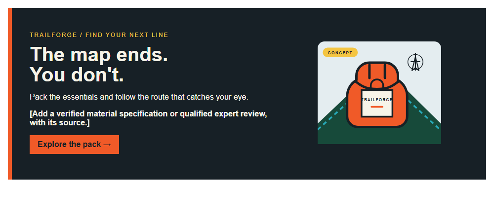
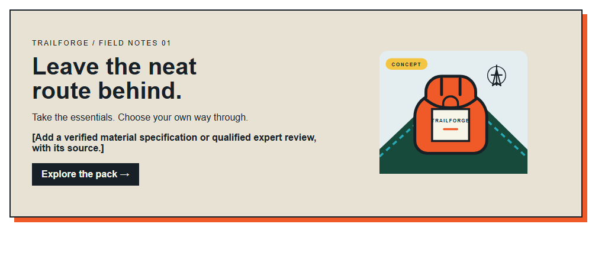

# Explorer
[Back to this section](README.md) · [Home](../README.md)

## What is it?
The Explorer is already halfway out the door. This archetype craves open roads, wrong turns that lead somewhere interesting, and the freedom to pick a new direction. Its voice is curious, gutsy, and full of momentum: less "stay where you are" and more "what's over there?"

## How do you recognize or use it?
The Explorer is for curious people who like independence, fresh air, new places, and choosing their own route. It should leave them feeling ready to move, not stuck reading a map forever. Its key traits are freedom to roam, curiosity, movement, challenge, preparation, and a self-chosen path.

Use active verbs, punchy phrases, and a little unexpected personality. Point the headline toward a place, challenge, or tempting detour, but keep the promise real. A large action image, compact navigation, bold headline, high-contrast CTA, and a small route or field-note detail can give the page energy while keeping it usable. Suggested type choices are [Oswald](https://fonts.google.com/specimen/Oswald) for trail-sign headlines, [Work Sans](https://fonts.google.com/specimen/Work+Sans) for body text and buttons, and [Caveat](https://fonts.google.com/specimen/Caveat) for an occasional map note.

## Examples
Both designs use TrailForge, a fictional outdoor backpack concept. The pack illustration is original concept artwork, not a photograph or a claim about an available product.

### Example 1

Archetype: Explorer  
Style: [Italian Futurism](../modernism/italian-futurism.md)  
Persuasion: [Authority](../persuasion/authority.md)  
Headline: The map ends. You don't.  
CTA: "Explore the pack" invites the reader to explore the fictional TrailForge pack.

The headline points toward independence and the next unknown. Sharp angles and a strong directional line echo Futurism. The Authority slot must be filled with verifiable product or expert evidence, not a vague quality claim.

### Example 2

Archetype: Explorer  
Style: [Grunge](../postmodernism/grunge.md)  
Persuasion: [Authority](../persuasion/authority.md)  
Headline: Leave the neat route behind.  
CTA: "Explore the pack" invites the reader to explore the fictional TrailForge pack.

The copy celebrates choosing your own direction without making unsupported promises about the pack. Grunge enters through the rough-edged frame and field-note label. The evidence slot is explicit rather than implying that an expert has already endorsed the concept.

Image credit: original hero concept by Omari Sellers, built in HTML/CSS and rendered to PNG; product illustration is an original SVG concept of a fictional brand.

## Sources
- [The North Face, official website](https://www.thenorthface.com/), web-design reference. The observations are independent interpretations, not official brand guidance.
- [AllTrails, official website](https://www.alltrails.com/), discovery and trail-search reference. The observations are independent interpretations, not official brand guidance.
- [Patagonia, official website](https://www.patagonia.com/), current brand reference. The visual interpretation is not official brand guidance.
- [Patagonia Nano-Puff Jacket, Wikimedia Commons](https://commons.wikimedia.org/wiki/File:Patagonia_Nano-Puff_Jacket_(51011161655).jpg), photo by Ajay Suresh, CC BY 2.0.
- [Buffalo AKG Art Museum, Giacomo Balla, *Dynamism of a Dog on a Leash*, 1912](https://buffaloakg.org/artworks/196416-dinamismo-di-un-cane-al-guinzaglio-dynamism-dog-leash).
- [The Museum of Modern Art, Giacomo Balla, *Speeding Automobile*, 1912](https://www.moma.org/collection/works/79343), an additional Futurist reference.
- [Vogue, "Ray Gun: The Magazine That Defined the Alt '90s Lives Again"](https://www.vogue.com/article/ray-gun-magazine-anthology). The editorial image and magazine design are copyrighted and were referenced for study, not reuse.
- [The Brand Archetypes, "The Explorer"](https://thebrandarchetypes.com/archetype/the-explorer/).

