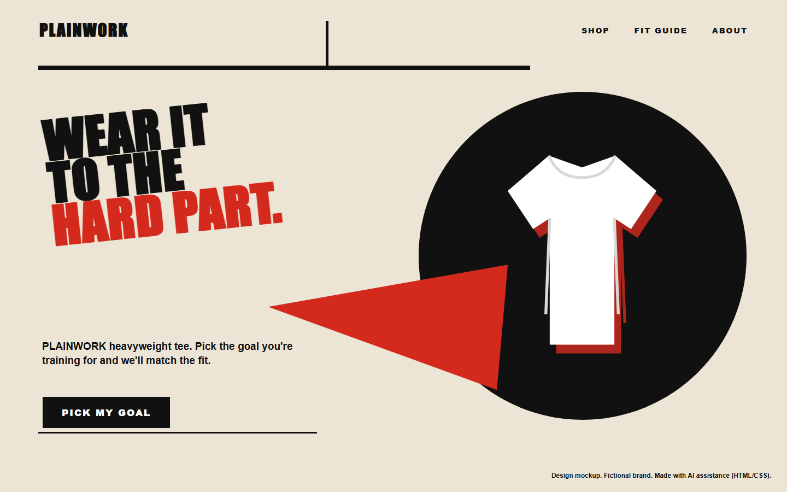
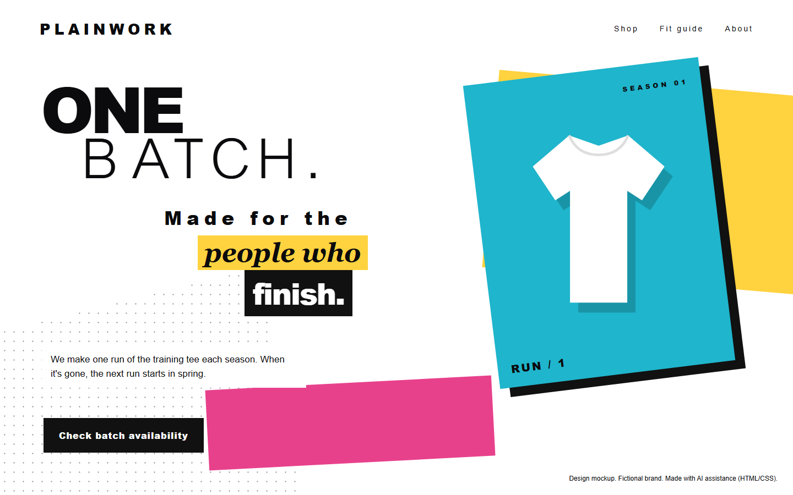

# Hero
[Back to this section](README.md) · [Home](../README.md)

## What is it?
The Hero archetype centers on proving worth through courageous, difficult action. Its goal is mastery used to improve the world. It speaks to people who want to meet a demanding standard, solve a hard problem, or become more capable through effort. Its central fear is weakness and vulnerability, especially the possibility of failing when action matters.

In brand communication, the Hero frames an offer as equipment, training, or support for a meaningful challenge. The audience remains the active figure. The message should give that audience a credible task and a clear measure of progress rather than presenting victory as automatic.

## How do you recognize or use it?
The tone is direct, motivating, and disciplined. Headlines often use active verbs and focus on practice, endurance, skill, or service. Imagery may show purposeful movement, preparation, focused faces, or a difficult environment. Strong red, black, blue, and white palettes can support urgency and resolve. Type is usually bold, condensed, or sharply structured, with a hierarchy that points clearly toward action.

The Hero works well for an audience that values competence and earned progress. Avoid empty claims of greatness. Give the person a concrete challenge and show how the offer helps them prepare or act.

Two persuasion principles fit especially well:

- Commitment and consistency: a voluntary first step can help the audience begin a demanding practice and continue in line with that choice.
- Scarcity: a real deadline or limited challenge window can give the action a clear boundary, provided the limit is accurate.

Planned styles are [Russian Constructivism](../modernism/russian-constructivism.md), which supplies forceful diagonals and collective purpose, and [New Wave](../postmodernism/new-wave.md), which can express energy through disrupted type and spacing.

## Examples
Both designs use the same fictional brand, PLAINWORK, which sells one plain white heavyweight T-shirt.

### Example 1

Archetype: Hero
Style: [Russian Constructivism](../modernism/russian-constructivism.md)
Persuasion: [Commitment / consistency](../persuasion/commitment-consistency.md)
Headline: WEAR IT TO THE HARD PART.
CTA: "Pick my goal" opens a short goal selector, then shows the fit that matches the chosen training goal.

The red wedge and sharp diagonal come from Lissitzky's *Beat the Whites with the Red Wedge* and give the page the forward push the Hero needs. The headline treats the shirt as gear for a hard task, so the reader stays the one doing the work. Picking a goal is a small, voluntary first step, and the shopper then continues toward a shirt that matches what they chose.

### Example 2

Archetype: Hero
Style: [New Wave](../postmodernism/new-wave.md)
Persuasion: [Scarcity](../persuasion/scarcity.md)
Headline: One batch. Made for the people who finish.
CTA: "Check batch availability" goes to the product page, which shows whether this season's run is still open.

New Wave's layered panels, stepped type and broken grid make the page feel energetic while still guiding the eye to one button. The Hero framing ("the people who finish") rewards effort, and the single seasonal batch gives the decision a real limit. The limit only works if the brand actually follows the one-run-per-season rule.

Image credit: both designs are original mockups built in HTML/CSS with AI assistance (Codex and Claude) and screenshotted. No photographs or museum images are reproduced.

## Sources
- Margaret Mark and Carol S. Pearson, *The Hero and the Outlaw: Building Extraordinary Brands Through the Power of Archetypes*. McGraw-Hill, 2001.
