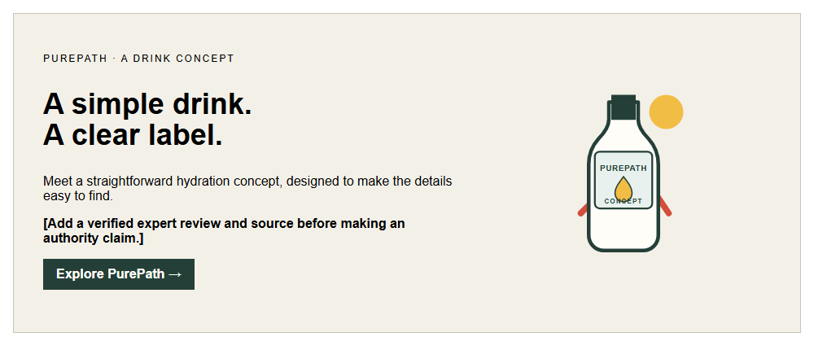
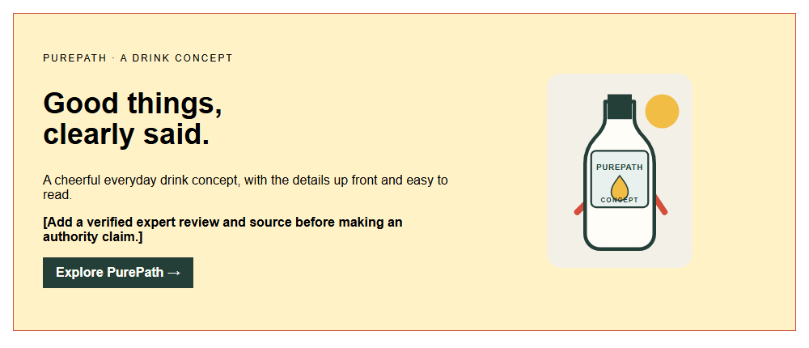

# Innocent
[Back to this section](README.md) · [Home](../README.md)

## What is it?
The Innocent archetype sees the sunny side, likes things simple, and wants people to feel in safe hands. Its voice is warm, honest, and reassuring, more friendly chat than grand announcement. It makes the good stuff easy to understand, with no fuss and no hard sell.

## How do you recognize or use it?
The Innocent suits people who like things clear, dependable, and positive. It helps a brand feel welcoming rather than complicated or intimidating, like a helpful friend who explains things plainly and means what they say.

Look for a hopeful outlook, plain and friendly words, cheerful pictures and colors, and reassurance built on honesty, trust, and care. Give a short, kind headline room to breathe, use everyday words, and avoid shouting or promises you cannot keep. A soft white or cream background, a fresh accent, one bright picture, and an easy-to-spot button are enough. Suggested type choices are [Mali](https://fonts.google.com/specimen/Mali) for a little headline personality and [Nunito](https://fonts.google.com/specimen/Nunito) for readable supporting words and buttons.

## Examples
Both designs use PurePath, a fictional everyday hydration drink concept. The bottle drawing is an original visual placeholder, not a photograph or representation of an existing product.

### Example 1

Archetype: Innocent  
Style: [Bauhaus](../modernism/bauhaus.md)  
Persuasion: [Authority](../persuasion/authority.md)  
Headline: A simple drink. A clear label.  
CTA: "Explore PurePath" invites the reader to explore the fictional PurePath drink concept.

Plain, reassuring language supports the Innocent archetype. The Bauhaus-inspired grid and restrained geometry put the message first. The authority element is deliberately an evidence placeholder, not an endorsement.

### Example 2

Archetype: Innocent  
Style: [Memphis](../postmodernism/memphis.md)  
Persuasion: [Authority](../persuasion/authority.md)  
Headline: Good things, clearly said.  
CTA: "Explore PurePath" invites the reader to explore the fictional PurePath drink concept.

The warm, direct wording stays innocent and approachable. Memphis-inspired color and irregular shapes bring energy. Any expert signal remains a clearly marked placeholder until there is verifiable evidence.

Image credit: original hero concept by Omari Sellers, built in HTML/CSS and rendered to PNG; product illustration is an original SVG concept of a fictional brand.

## Sources
- [Innocent Drinks, official website](https://www.innocentdrinks.co.uk/), current brand reference. The visual observations are design analysis, not official brand guidelines.
- [Innocent Smoothie, Wikimedia Commons](https://commons.wikimedia.org/wiki/File:Innocent_Smoothie.jpg), product photograph by Mx. Granger, CC0.
- [Innocent Bubbles 1, Wikimedia Commons](https://commons.wikimedia.org/wiki/File:Innocent_Bubbles_1.jpg), product photograph by Mx. Granger, CC0.
- [Marcel Breuer, "Wassily" Armchair, The Met](https://www.metmuseum.org/art/collection/search/485067), historical object reference. The source page used an image from Wikimedia Commons.
- [George Sowden, "Penrose Fruit Bowl," The Met](https://www.metmuseum.org/art/collection/search/751926), historical object reference. The accompanying schematic was an original study, not a reproduction.
- [The Metropolitan Museum of Art, "Ettore Sottsass: Exhibition Galleries"](https://www.metmuseum.org/exhibitions/listings/2017/ettore-sottsass).
- [The Brand Archetypes, "The Innocent"](https://thebrandarchetypes.com/archetype/the-innocent/).
- [Bauhaus, 1919 to 1933, The Metropolitan Museum of Art](https://www.metmuseum.org/essays/the-bauhaus-1919-1933), historical context for the functional, geometric design direction.
- [Federal Trade Commission, Endorsements, Influencers, and Reviews](https://www.ftc.gov/business-guidance/advertising-marketing/endorsements-influencers-reviews), guidance for truthful, properly supported endorsements and reviews.
- [Influence at Work, "The 7 Principles of Persuasion"](https://www.influenceatwork.com/7-principles-of-persuasion/), overview of Authority and Social Proof.

