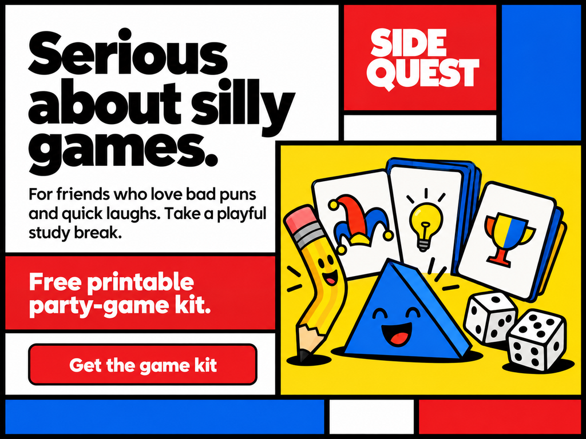
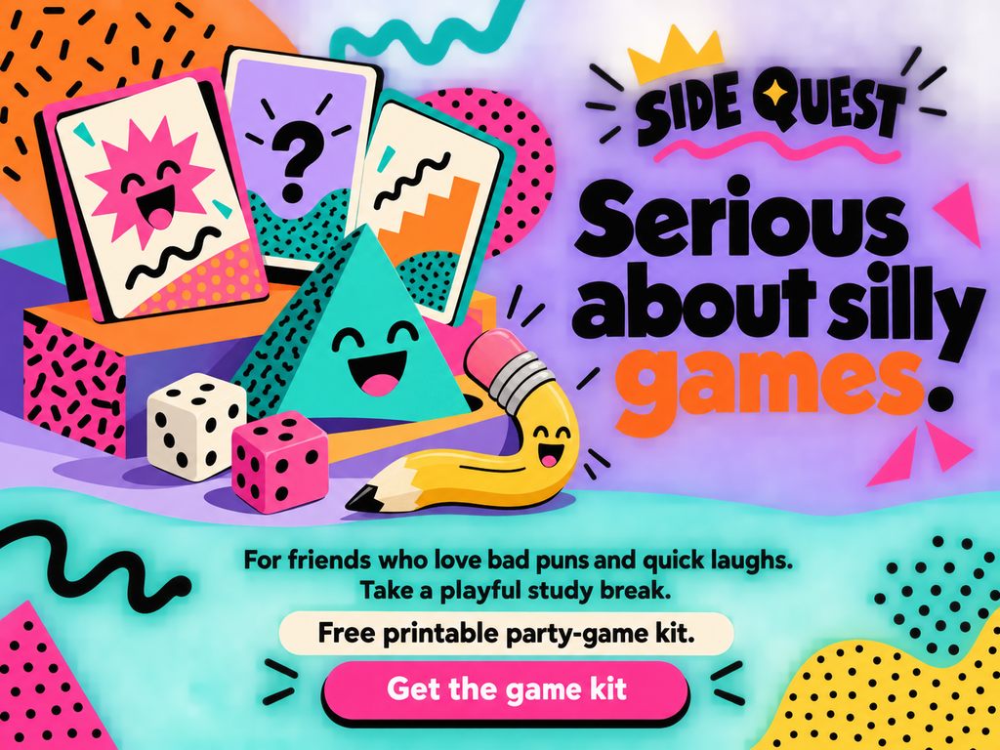
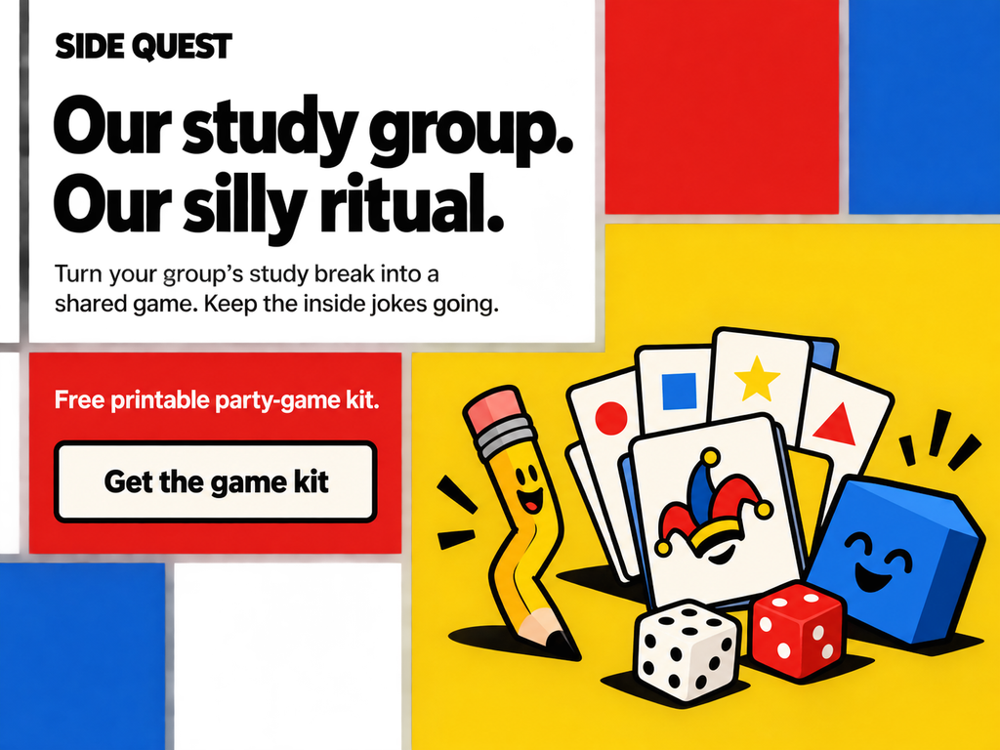
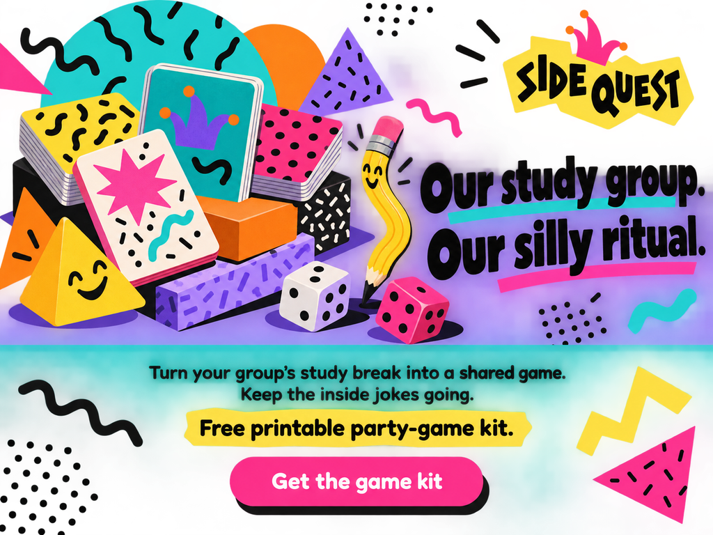
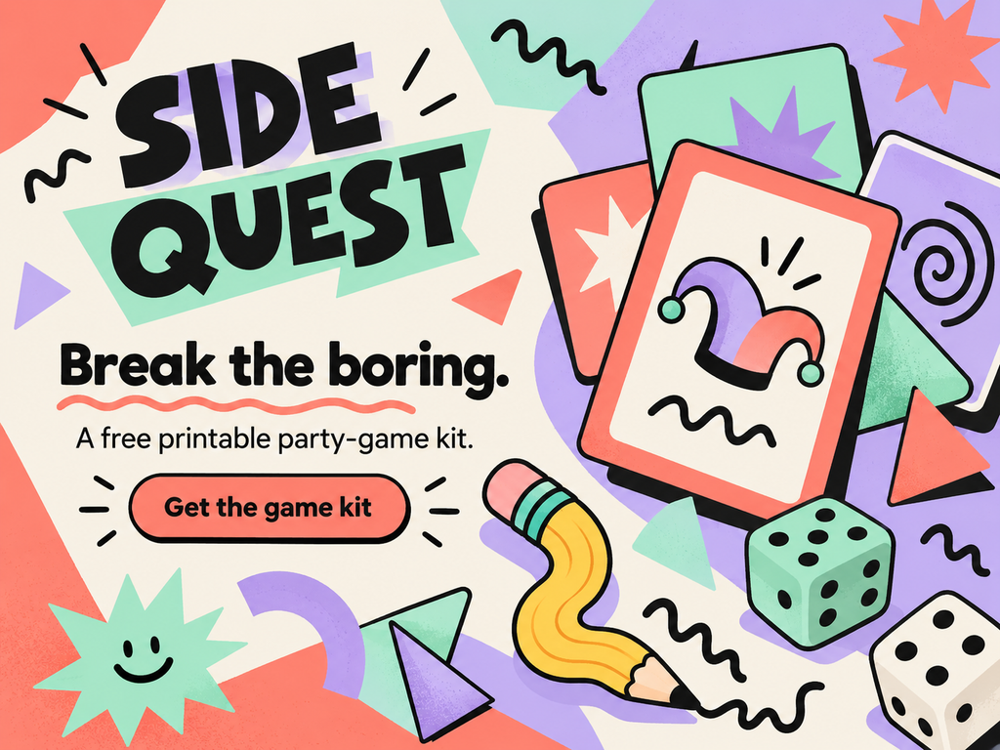

# Jester

[Home](../README.md) · Brennan Dahmen

## Motivation and cues

The Jester seeks enjoyment, playful connection, and relief from excessive seriousness. A light voice, surprising objects, and a harmless visual joke can make a short break feel inviting. Use it when play is part of the actual experience. Avoid jokes at the audience's expense or humor that hides what the product does.

[Carol S. Pearson's Jester description](https://carolspearson.com/archetype-pages/jester-archetype) grounds the focus on play and enjoyment; the product and visual applications here are original.

### Real brand example

[Wieden+Kennedy's Old Spice campaign record](https://www.wk.com/work/old-spice-smell-like-a-man-man/) documents *Smell Like a Man, Man*. My interpretation is that its absurd transitions and knowingly exaggerated performance demonstrate Jester cues while selling body wash. Humor attracts attention to a real product rather than serving as decoration alone; this is my classification of the campaign.

## Researched style references

**De Stijl:** [Piet Mondrian, *Composition in Red, Blue, and Yellow*, 1937–42 (MoMA)](https://www.moma.org/collection/works/80160) provides the reference for primary-color rectangles and horizontal/vertical organization. I adapt that modernist structure into zones for copy, illustration, and action. The cartoon product drawing is original and is not presented as a historical De Stijl artwork.

**Memphis:** [Ettore Sottsass, *Carlton* room divider, 1981 (The Met)](https://www.metmuseum.org/art/collection/search/486989) provides a postmodern reference for playful stacked geometry and decorative surfaces. The heroes translate that approach into colorful platforms, patterns, and deliberately surprising shapes rather than copying furniture.

## Brief

| Constant | Decision |
|---|---|
| Brand | SIDE QUEST, an original fictional concept |
| Audience | college study groups who want a short playful break |
| Product and core offer | Free printable party-game kit. |
| Action | Get the game kit |
| Modernist comparison | De Stijl |
| Postmodern/eclectic comparison | Memphis |
| Principle A / principle B | [Liking](../persuasion/liking.md) / [Unity](../persuasion/unity.md) |
| Medium and size | Generated editorial illustration; four static 1024 × 768 PNGs, displayed at 640 pixels wide |

**CTA destination:** A proposed direct download of one printable party-game kit, with no account or purchase required. The hero assignment does not include producing the kit itself.

The brand, audience, offer, and action remain constant. Heroes 1–2 share Liking copy; heroes 3–4 share Unity copy. Style changes affect type, color, texture, and composition. These are static mockups; pictured buttons are not interactive.

## Hero 1: De Stijl + Liking



**Headline:** Serious about silly games.

**Supporting copy:** For friends who love bad puns and quick laughs. Take a playful study break.

**Offer:** Free printable party-game kit. **CTA:** Get the game kit — same destination as the brief.

The bent smiling pencil and cheerful game pieces make the Jester's playfulness visible. Liking is invited through the brand's compatible sense of humor and the audience's enjoyment of bad puns. Mondrian-inspired rectangular zones organize the joke without making the action difficult to locate.

## Hero 2: Memphis + Liking



**Headline:** Serious about silly games.

**Supporting copy:** For friends who love bad puns and quick laughs. Take a playful study break.

**Offer:** Free printable party-game kit. **CTA:** Get the game kit — same destination as the brief.

The same shared-humor copy keeps Liking consistent. Memphis-inspired stacked shapes, lavender/turquoise color, and busy patterns make the Jester feel more exuberant than the modernist version. The separate bottom panel gives the offer and CTA a quieter reading area.

## Hero 3: De Stijl + Unity



**Headline:** Our study group. Our silly ritual.

**Supporting copy:** Turn your group's study break into a shared game. Keep the inside jokes going.

**Offer:** Free printable party-game kit. **CTA:** Get the game kit — same destination as the brief.

The playful kit serves an existing study group's shared break, which makes Unity more specific than a general appeal to funny people. The group language and inside jokes identify the bond. Orthogonal color blocks provide the De Stijl structure while the illustrated objects maintain the Jester cue.

## Hero 4: Memphis + Unity



**Headline:** Our study group. Our silly ritual.

**Supporting copy:** Turn your group's study break into a shared game. Keep the inside jokes going.

**Offer:** Free printable party-game kit. **CTA:** Get the game kit — same destination as the brief.

The shared ritual and inside jokes carry Unity, while the curved pencil and patterned objects communicate Jester. The Memphis reference appears through decorative geometry, bright mixed colors, and playful imbalance. Copy stays in a dedicated lower panel so the energy does not hide the download action.

## Comparison

Hero 4 is my strongest choice for the specified audience of existing study groups. Its copy names a shared ritual, and the expressive Memphis layout previews a playful break. Hero 2 works better for visitors who have not formed a group yet. Heroes 1 and 3 provide clearer separation of information, but feel more structured than spontaneous.

Style changes the reading rhythm and visual personality; persuasion changes the relationship named in the copy. Those judgments come from visual review, not conversion measurements.

## Process and rejected draft



The initial draft's “Break the boring” slogan conveyed Jester but did not identify a persuasive relationship. I changed the copy after my own critique showed that a playful tone alone did not demonstrate Liking or Unity. The final copy distinguishes a compatible sense of humor from an existing group's inside jokes.

**Key prompt decisions:** Keep SIDE QUEST, the exact offer, and “Get the game kit” across all four versions. Show a fan of playful generic game cards, a comically bent pencil, a smiling geometric shape and dice, visually funny but clear product preview. No people; editorial illustration. Change only the specified style and persuasion direction, keep copy readable, and invent no testimonials, statistics, or urgency. The complete submitted prompts, including the rejected draft, are saved in [generation-prompts.json](../assets/archetype/Jester/generation-prompts.json).

**Feedback status:** The revision described above is self-critique with AI assistance. A teammate's comprehension check and PR review still need to happen; none are claimed here. The earlier request for smaller images and clearer visual differences informed the 640-pixel display size and contrasting style palettes.

## Narrow-screen sketch

```text
Brand
↓
headline
↓
one compact game illustration
↓
supporting copy
↓
free-kit offer
↓
full-width download button. Retain one patterned edge for Memphis, or a simple rectangular divider for De Stijl, instead of squeezing the desktop grid.
```

For a later website implementation, rebuild the copy as HTML text rather than shrinking the entire raster image. Preserve headline → explanation → action order, with enough space to tap the button.

## Sources and credits

Historical style and real-brand sources are linked at the point of use above. The [Liking](../persuasion/liking.md) and [Unity](../persuasion/unity.md) pages contain the persuasion source and fuller explanations. Archetype classification, adaptations, and comparisons are design interpretations.

All five images on this page are AI-generated assignment mockups made with OpenAI image generation on October 2, 2026. They are not historical reference images, real product photographs, or published campaigns. Prompt records are stored locally with the assets.

