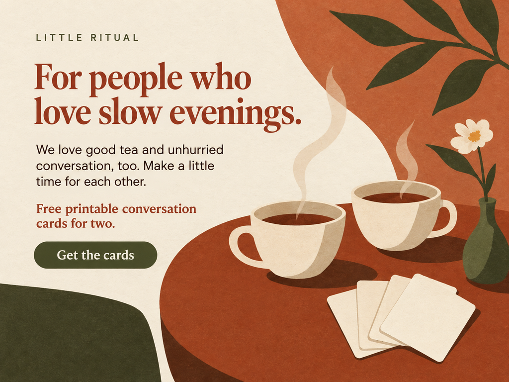
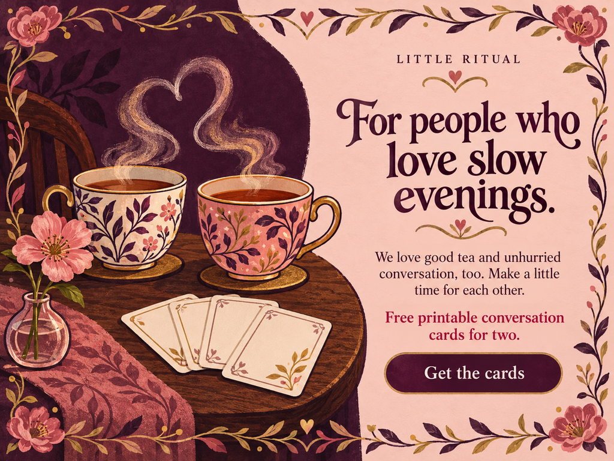
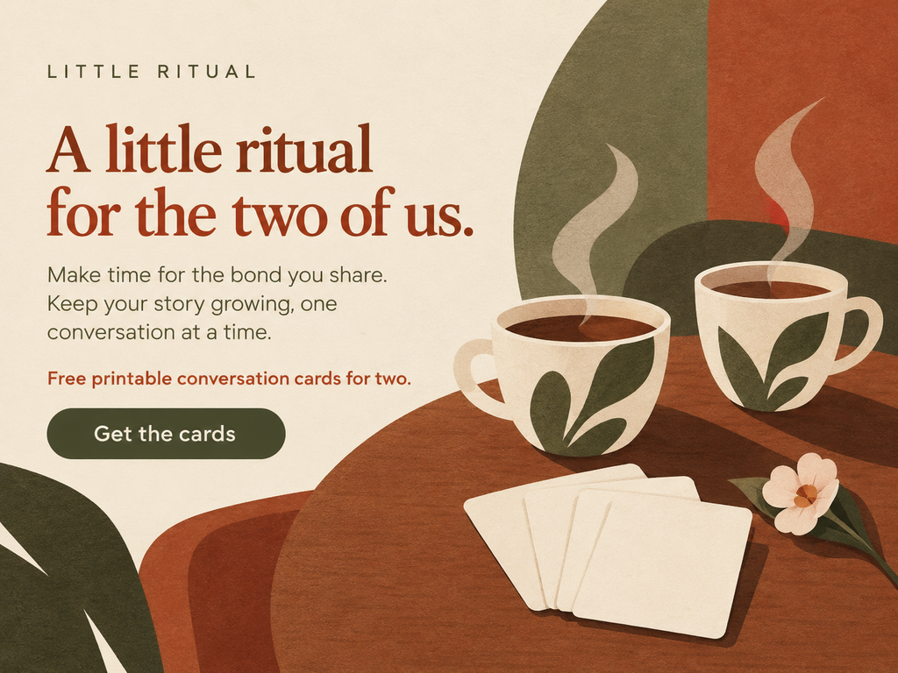
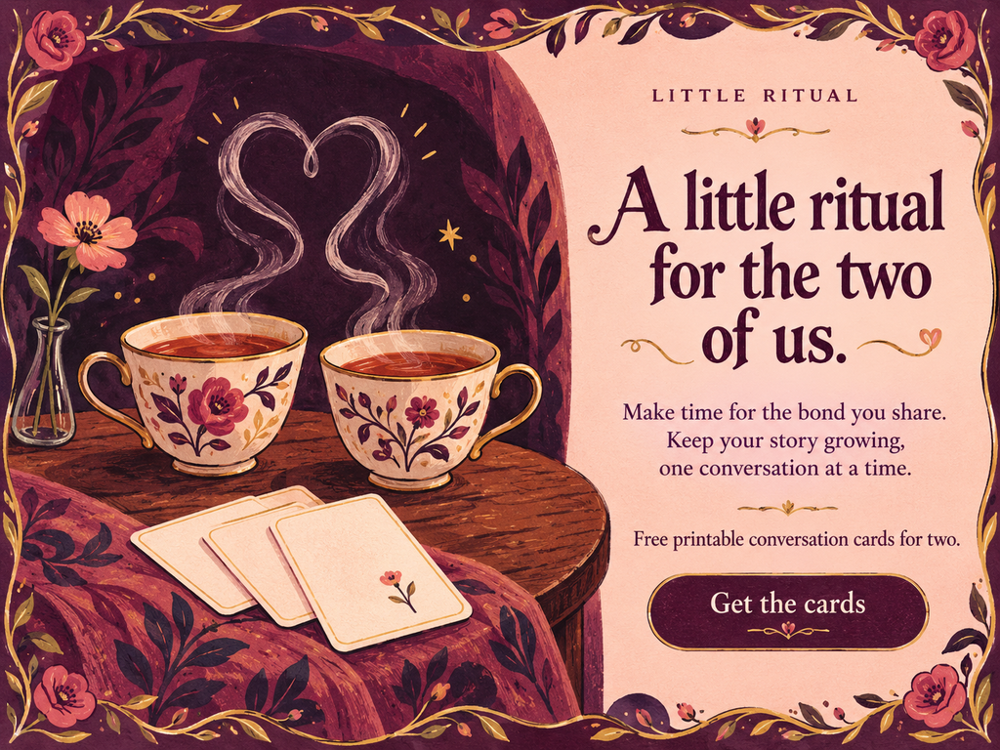
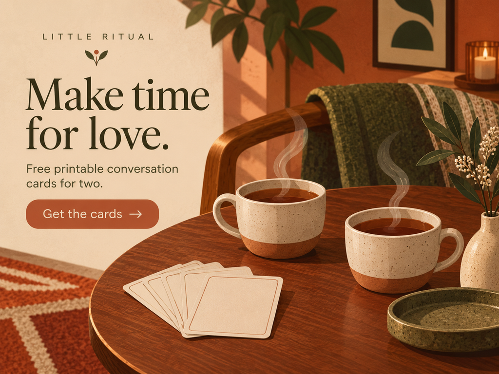

# Lover

[Home](../README.md) · Brennan Dahmen

## Motivation and cues

The Lover values connection, appreciation, intimacy, and a rich sensory experience. Two cups, warm color, careful spacing, and language about time together make the audience's relationship central. Use this approach for gifts, shared experiences, and products that support attention to another person. Avoid implying that a purchase proves love or repairs a relationship.

[Carol S. Pearson's Lover description](https://carolspearson.com/archetype-pages/lover-archetype) supports the emphasis on relationships and appreciation. The fictional product makes that theme concrete through a shared conversation.

### Real brand example

[GODIVA's Valentine's Day gift guide](https://www.godiva.com/pages/2026-valentines-day-gift-guide) markets chocolates as gifts for expressing affection. My interpretation is that the combination of sensory pleasure and a relationship-centered occasion fits Lover. This is a reading of the marketing, not an official archetype label or a claim about current stock.

## Researched style references

**Mid-Century modernist graphics:** [Saul Bass, *Anatomy of a Murder* poster, 1959 (SFMOMA)](https://www.sfmoma.org/artwork/2000.514/) provides a reference for economical silhouette and cut-paper shape. I adapt reduction and asymmetrical balance into simple cups, leaves, and generous space; the subject and warm palette are my own choices.

**Push Pin:** [Seymour Chwast, *End Bad Breath*, 1967 (Poster House)](https://collection.posterhouse.org/poster/end-bad-breath/) combines expressive illustration, historic graphic references, and a visual metaphor. I adapt that image-led, eclectic approach into outlined cups, decorative lettering, and heart-shaped steam. The final art is gentler and more floral than Chwast's source, so this is an adaptation rather than a reproduction.

**Historical distinction:** Push Pin was founded in 1954 and overlaps the mid-century period. It is used here as the assignment's eclectic/postmodern comparison to restrained modernist graphics, not as a movement that began after the 1970s. [Cooper Hewitt's Milton Glaser account](https://www.cooperhewitt.org/2020/06/29/milton-glaser-1929-2020/) documents the studio's beginnings.

## Brief

| Constant | Decision |
|---|---|
| Brand | LITTLE RITUAL, an original fictional concept |
| Audience | adult couples looking for an unhurried shared evening |
| Product and core offer | Free printable conversation cards for two. |
| Action | Get the cards |
| Modernist comparison | Mid-Century |
| Postmodern/eclectic comparison | Push Pin |
| Principle A / principle B | [Liking](../persuasion/liking.md) / [Unity](../persuasion/unity.md) |
| Medium and size | Generated editorial illustration; four static 1024 × 768 PNGs, displayed at 640 pixels wide |

**CTA destination:** A proposed direct download of the same printable conversation-card set in every version. No sign-up is required in this concept. The cards themselves are outside the static-hero assignment.

The brand, audience, offer, and action remain constant. Heroes 1–2 share Liking copy; heroes 3–4 share Unity copy. Style changes affect type, color, texture, and composition. These are static mockups; pictured buttons are not interactive.

## Hero 1: Mid-Century + Liking



**Headline:** For people who love slow evenings.

**Supporting copy:** We love good tea and unhurried conversation, too. Make a little time for each other.

**Offer:** Free printable conversation cards for two. **CTA:** Get the cards — same destination as the brief.

The two cups and unhurried tone support Lover's emphasis on attention and connection. Liking appears when the brand explicitly shares the audience's love of tea and slow conversation. Reduced shapes and open space adapt the modernist economy of the Bass reference.

## Hero 2: Push Pin + Liking



**Headline:** For people who love slow evenings.

**Supporting copy:** We love good tea and unhurried conversation, too. Make a little time for each other.

**Offer:** Free printable conversation cards for two. **CTA:** Get the cards — same destination as the brief.

The shared-preference copy preserves Liking while the paired cups and heart-like steam maintain Lover. Decorative type, outlined illustration, and historical ornament adapt the eclectic Push Pin approach. The pale text panel separates the action from the more elaborate drawing.

## Hero 3: Mid-Century + Unity



**Headline:** A little ritual for the two of us.

**Supporting copy:** Make time for the bond you share. Keep your story growing, one conversation at a time.

**Offer:** Free printable conversation cards for two. **CTA:** Get the cards — same destination as the brief.

The language refers to the couple's existing bond and shared story, making Unity the mechanism. Two coordinated cups reinforce the pair without suggesting a specific gender or relationship stereotype. Simplified shapes and quiet spacing keep the Mid-Century interpretation restrained.

## Hero 4: Push Pin + Unity



**Headline:** A little ritual for the two of us.

**Supporting copy:** Make time for the bond you share. Keep your story growing, one conversation at a time.

**Offer:** Free printable conversation cards for two. **CTA:** Get the cards — same destination as the brief.

Unity is carried by “the two of us” and the existing shared story. The steam connecting the cups becomes a Lover visual metaphor, while expressive illustration and decorative lettering provide the Push Pin interpretation. The button remains separate from the ornament.

## Comparison

Hero 3 is my strongest everyday choice because its existing-pair language fits the audience and its quiet layout gives the relationship room to lead. Hero 4 is a useful alternative for a more expressive gift-oriented presentation, but its ornament draws more attention. Heroes 1 and 2 establish affinity with the brand; heroes 3 and 4 more directly explain what the cards support between the users.

Style changes the reading rhythm and visual personality; persuasion changes the relationship named in the copy. Those judgments come from visual review, not conversion measurements.

## Process and rejected draft



The first draft looked too much like a photographic living room and used the broad slogan “Make time for love.” I changed the medium and copy after my own critique showed that the image and persuasion mechanism were insufficiently specific. Final versions use illustrated cups and cards, plus separate shared-taste and shared-bond messages.

**Key prompt decisions:** Keep LITTLE RITUAL, the exact offer, and “Get the cards” across all four versions. Show exactly two tea cups with gentle steam beside a small fan of blank conversation cards, a quiet table and one small flower. No people; flat editorial illustration with paper texture. Change only the specified style and persuasion direction, keep copy readable, and invent no testimonials, statistics, or urgency. The complete submitted prompts, including the rejected draft, are saved in [generation-prompts.json](../assets/archetype/Lover/generation-prompts.json).

**Feedback status:** The revision described above is self-critique with AI assistance. A teammate's comprehension check and PR review still need to happen; none are claimed here. The earlier request for smaller images and clearer visual differences informed the 640-pixel display size and contrasting style palettes.

## Narrow-screen sketch

```text
Brand
↓
headline
↓
supporting copy
↓
free-card offer
↓
full-width download button
↓
compact illustration showing both cups and cards. Keep both cups together. Reduce the floral border to two corners and preserve readable space around the CTA.
```

For a later website implementation, rebuild the copy as HTML text rather than shrinking the entire raster image. Preserve headline → explanation → action order, with enough space to tap the button.

## Sources and credits

Historical style and real-brand sources are linked at the point of use above. The [Liking](../persuasion/liking.md) and [Unity](../persuasion/unity.md) pages contain the persuasion source and fuller explanations. Archetype classification, adaptations, and comparisons are design interpretations.

All five images on this page are AI-generated assignment mockups made with OpenAI image generation on October 2, 2026. They are not historical reference images, real product photographs, or published campaigns. Prompt records are stored locally with the assets.

