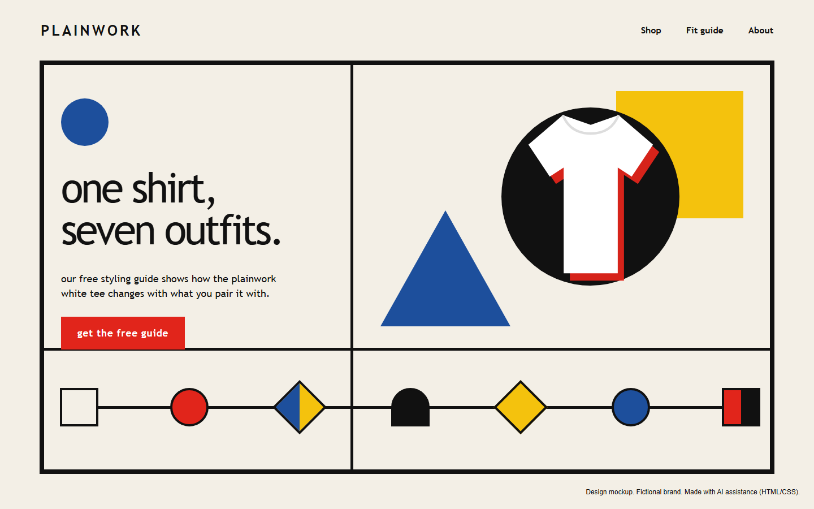
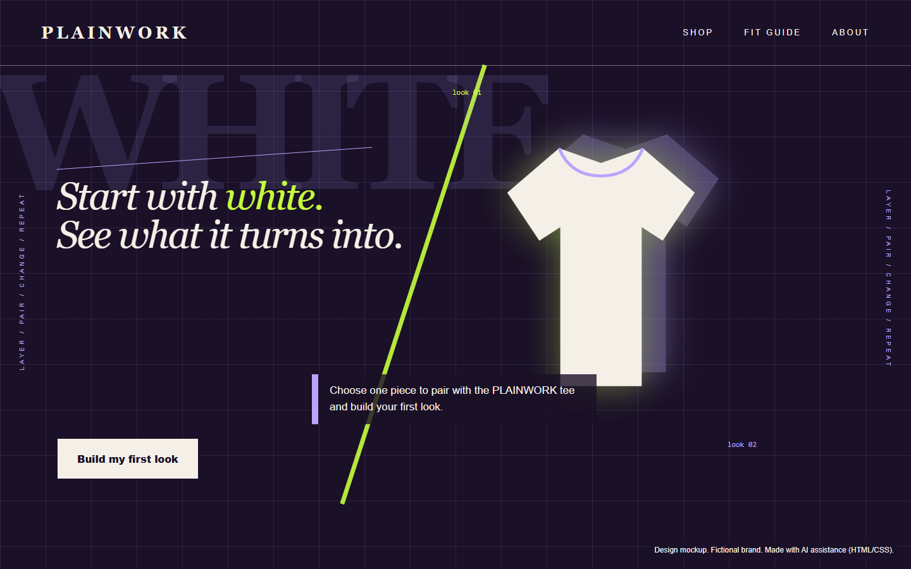

# Magician
[Back to this section](README.md) · [Home](../README.md)

## What is it?
The Magician archetype seeks to understand how the world works and use that knowledge to make things happen. Its goal is transformation, turning a vision into reality through skill, discovery, or an unexpected connection. Its central fear is causing unintended negative consequences. That concern gives the archetype a sense of responsibility alongside its fascination with change.

The typical audience wants to move from the current situation toward a striking new possibility. They may be drawn to invention, personal change, hidden systems, or experiences that alter perception. A Magician message presents the offer as a catalyst, while still making the process believable enough for the audience to follow.

## How do you recognize or use it?
The tone is confident and a little mysterious. It can suggest discovery without becoming vague. Visual cues include transitions, light effects, reflections, layered spaces, unexpected scale, and images that show one state becoming another. Deep violet, blue, black, and luminous accent colors often suit the mood. Type may be elegant or geometric, with careful spacing and a controlled sense of reveal.

Use the Magician when transformation is central to the offer and there is a clear explanation of what changes. Show a connection between action and outcome. Avoid promises that appear supernatural when the offer depends on an ordinary process.

Two persuasion principles fit especially well:

- Authority: relevant expertise can make an unfamiliar process understandable and credible when qualifications are stated accurately.
- Commitment and consistency: a small voluntary action can begin the transformation and help the audience continue toward its chosen vision.

Planned styles are [Bauhaus](../modernism/bauhaus.md), whose basic shapes and primary colors can show one thing becoming many, and [Deconstruction (Cranbrook)](../postmodernism/deconstruction.md), whose layered type and images suit a sense of hidden change.

## Examples
Both designs use the same fictional brand, PLAINWORK, which sells one plain white heavyweight T-shirt.

### Example 1

Archetype: Magician
Style: [Bauhaus](../modernism/bauhaus.md)
Persuasion: [Reciprocity](../persuasion/reciprocity.md)
Headline: one shirt, seven outfits.
CTA: "get the free guide" opens the free styling guide, with no purchase or sign-up required.

The all-lowercase geometric type follows Herbert Bayer's Bauhaus lettering, and the row of basic shapes in primary colors shows one shirt turning into seven looks. That change is the Magician's promise, kept believable because it comes from simple pairing, not a miracle. Giving the guide away first is Reciprocity: the brand offers something useful before it asks for anything.

### Example 2

Archetype: Magician
Style: [Deconstruction (Cranbrook)](../postmodernism/deconstruction.md)
Persuasion: [Commitment / consistency](../persuasion/commitment-consistency.md)
Headline: Start with white. See what it turns into.
CTA: "Build my first look" opens an outfit builder where the shopper picks one piece to pair with the tee.

Layered, overlapping type at several reading levels comes from the Cranbrook work of Katherine McCoy and Ed Fella, and the doubled shirt suggests something changing under the surface. The Magician headline invites the viewer to watch a transformation they start themselves. Building one look is a small first commitment that leads naturally to the next look and then the purchase.

Image credit: both designs are original mockups built in HTML/CSS with AI assistance (Codex and Claude) and screenshotted. No photographs or museum images are reproduced.

## Sources
- Margaret Mark and Carol S. Pearson, *The Hero and the Outlaw: Building Extraordinary Brands Through the Power of Archetypes*. McGraw-Hill, 2001.
