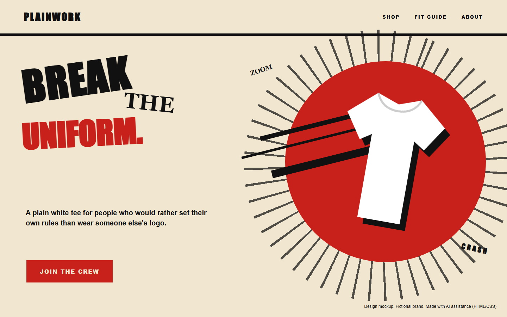
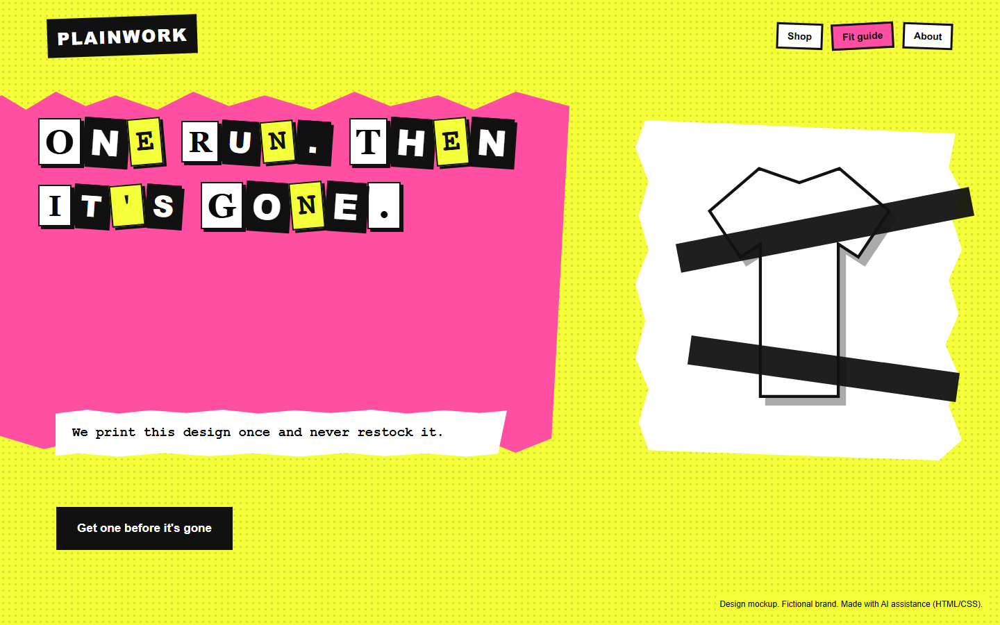

# Rebel / Outlaw
[Back to this section](README.md) · [Home](../README.md)

## What is it?
The Rebel, also called the Outlaw, is driven by revolution and the urge to break rules that have stopped working. Its goal is to overturn failed systems, habits, or expectations. Its central fear is powerlessness and being ignored. This archetype appeals to people who feel restricted by convention and want a direct way to reject it.

In communication, the Rebel identifies a rule or institution as the opponent. A strong Rebel message explains what should change and gives the audience a specific act of refusal or replacement. Anger can supply energy, but the offer still needs a purpose beyond provocation.

## How do you recognize or use it?
The tone is blunt, challenging, and anti-establishment. Short commands, crossed-out phrases, interruptions, and altered official symbols can express resistance. Visual cues include torn surfaces, extreme contrast, black with an aggressive accent color, rough collage, and type that looks stamped, cut, or rapidly printed. Imagery often shows confrontation, disruption, or people acting outside a familiar system.

The typical audience is skeptical of polished authority and sensitive to rules that protect an outdated status quo. Use the archetype when a product or cause can clearly state which convention it rejects. Avoid rebellion as a decorative pose, since an undefined enemy makes the message feel hollow.

Two persuasion principles fit especially well:

- Scarcity: a truthful limited release can make participation feel tied to a specific moment of resistance.
- Unity: shared symbols and language can identify an insider group joined by the same cause.

Planned styles are [Italian Futurism](../modernism/italian-futurism.md), with its forceful motion and typographic disruption, and [Punk](../postmodernism/punk.md), with its DIY collage and attacks on official imagery.

## Examples
Both designs use the same fictional brand, PLAINWORK, which sells one plain white heavyweight T-shirt.

### Example 1

Archetype: Rebel / Outlaw
Style: [Italian Futurism](../modernism/italian-futurism.md)
Persuasion: [Unity](../persuasion/unity.md)
Headline: BREAK THE UNIFORM.
CTA: "Join the crew" opens a sign-up page for the brand's mailing list.

Futurism's speed lines and words scattered at different angles borrow from Marinetti's "words in freedom" and make the page feel like it is breaking apart its own layout. The Rebel message names the opponent (logos and dress codes) and offers a plain shirt as the act of refusal. "Join the crew" turns that refusal into membership in a group, which is how Unity works: people say yes more readily to those they see as part of "us."

### Example 2

Archetype: Rebel / Outlaw
Style: [Punk](../postmodernism/punk.md)
Persuasion: [Scarcity](../persuasion/scarcity.md)
Headline: ONE RUN. THEN IT'S GONE.
CTA: "Get one before it's gone" goes to the product page for this print.

The ransom-note letters and fluorescent yellow and pink come straight from Jamie Reid's Sex Pistols graphics, and the torn edges give it the photocopied, homemade feel of punk. The Rebel tone fits a print that refuses to be restocked. Scarcity is honest here only if the shop really prints the design once, and the plain black button keeps the action easy to find inside the noise.

Image credit: both designs are original mockups built in HTML/CSS with AI assistance (Codex and Claude) and screenshotted. No photographs or museum images are reproduced.

## Sources
- Margaret Mark and Carol S. Pearson, *The Hero and the Outlaw: Building Extraordinary Brands Through the Power of Archetypes*. McGraw-Hill, 2001.
