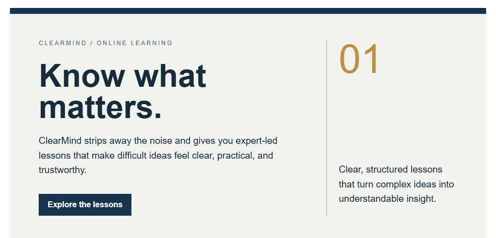
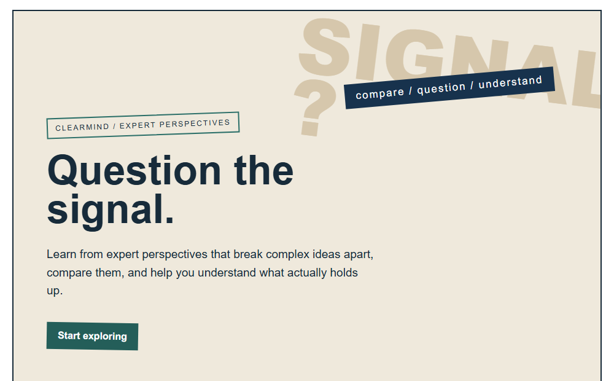

# Sage
[Back to this section](README.md) · [Home](../README.md)

## What is it?
The Sage archetype is built around knowledge, truth, and understanding. A Sage brand does not simply announce that it is an expert. It shows how it knows, explains what the evidence can support, and makes room for the audience to think.

## How do you recognize or use it?
The Sage appeals to people who value research, learning, careful decisions, and credible expertise. Use it to help an audience understand a subject without overwhelming them with jargon or asking them to trust an unsupported claim. Its main qualities are evidence before assertion, curiosity over certainty, and clarity with humility.

Frame a specific question, give a measured plain-language insight, show the evidence behind it, name limits or uncertainty, and offer a useful next step. A clear size hierarchy, comfortable spacing, readable source notes, and visible links help readers inspect the reasoning. [Source Serif 4](https://fonts.google.com/specimen/Source+Serif+4) can give headlines a reflective quality, while [Source Sans 3](https://fonts.google.com/specimen/Source+Sans+3) keeps evidence, captions, and buttons direct.

## Examples
Both designs use ClearMind, a fictional online learning platform for curious people who want reliable knowledge without the noise.

### Example 1

Archetype: Sage  
Style: [Swiss / International Typographic Style](../modernism/swiss-international.md)  
Persuasion: [Authority](../persuasion/authority.md)  
Headline: Know what matters.  
CTA: "Explore the lessons" invites the reader to explore ClearMind's lessons.

The Sage archetype is expressed through the desire for understanding, expertise, and reliable knowledge. Authority is presented as the route to credibility and clarity. The Swiss visual system supports that message through disciplined structure, calm spacing, and strong information hierarchy.

### Example 2

Archetype: Sage  
Style: [Deconstruction](../postmodernism/deconstruction.md)  
Persuasion: [Authority](../persuasion/authority.md)  
Headline: Question the signal.  
CTA: "Start exploring" invites the reader to begin exploring ClearMind.

The Sage archetype appears through investigation, intellectual rigor, and the urge to understand ideas beyond the surface. Authority is reinforced by presenting expert knowledge as a foundation for evaluating arguments critically. The deconstructive layout mirrors the act of breaking down assumptions and seeing relationships more clearly.

Image credit: original hero concept by Omari Sellers, built in HTML/CSS and rendered to PNG; this concept uses typography and geometric layout without a product illustration.

## Sources
- [Our World in Data](https://ourworldindata.org/) and its [mission and methods](https://ourworldindata.org/about), research-led explanations and linked evidence. The design observations are independent.
- [Wikimedia Commons, Josef Muller-Brockmann, *Juni-Festwochen Zurich* poster, 1957](https://commons.wikimedia.org/wiki/File:Josef_M%C3%BCller-Brockmann_1957.jpg), image page and file description. Check its listed rights for the intended jurisdiction and reuse.
- [The Museum of Modern Art, Josef Muller-Brockmann, *Poster for a concert at Tonhalle Zurich*, 1953](https://www.moma.org/collection/works/6257).
- [The Museum of Modern Art, Josef Muller-Brockmann artist page](https://www.moma.org/artists/4154-josef-muller-brockmann).
- [April Greiman / Made in Space, *Design Quarterly* 133: "Does It Make Sense?"](https://www.madeinspace.la/dq133), project description. The page credits its descriptive text to Walker Art Center.
- [Wikimedia Commons, *Design Quarterly* 133: *Does It Make Sense?*](https://commons.wikimedia.org/wiki/File:Design_Quarterly_133_-_Does_It_Make_Sense.jpg), image file, uploader attribution, and license metadata. The upload lists CC BY-SA 4.0, while underlying artwork rights remain separate.
- [The Museum of Modern Art, April Greiman, *Does It Make Sense?*, 1986](https://www.moma.org/collection/works/163789).
- [The Museum of Modern Art, April Greiman artist page](https://www.moma.org/artists/2334-april-greiman).
- [The Brand Archetypes, "The Sage"](https://thebrandarchetypes.com/archetype/the-sage/).

