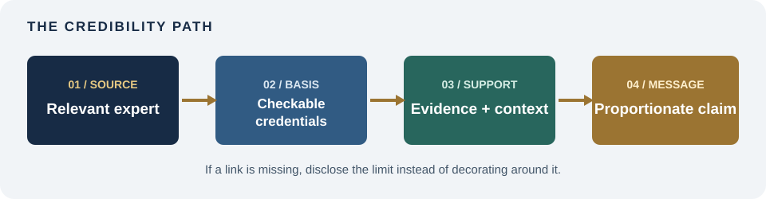
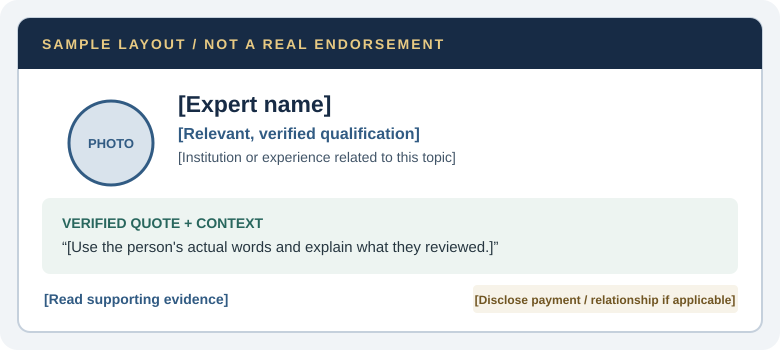
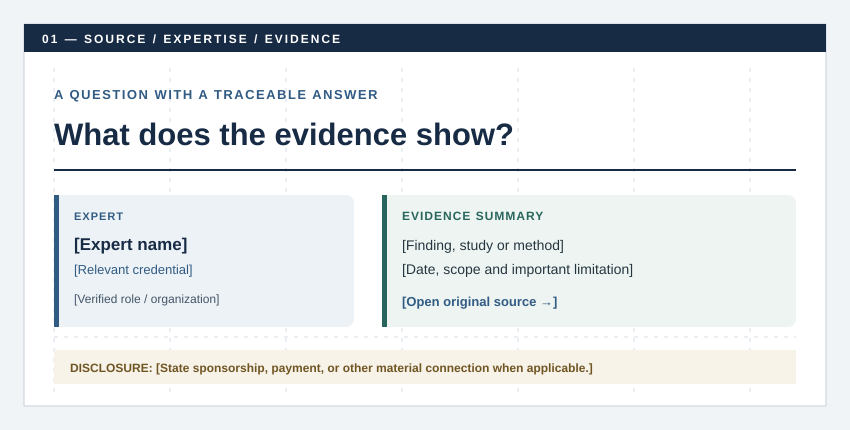
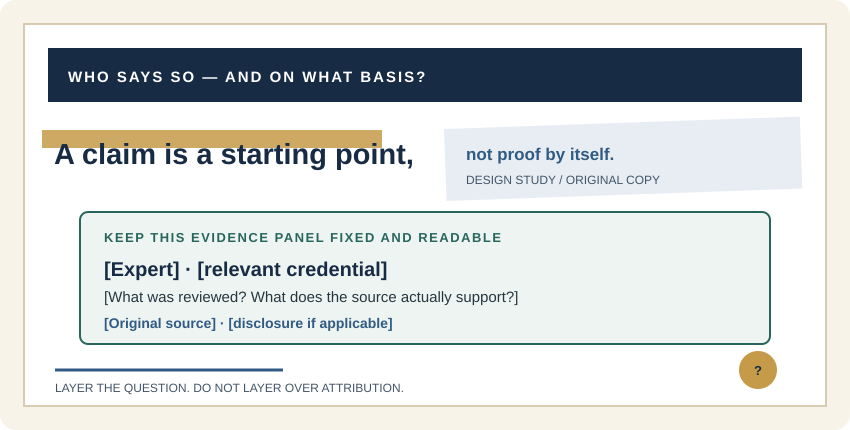

# Authority
[Home](../README.md)

  
A field guide to credible claims

  <h2 style="margin:0 0 12px; color:#ffffff; font-family:'IBM Plex Serif', Georgia, serif; font-size:2.25rem; line-height:1.1;">Show who knows. Show how they know.</h2>
  
Authority is not a badge you add to a page. It is relevant expertise, evidence readers can inspect, and honest context.

## What authority means

Authority is a persuasion principle: people may give more weight to a recommendation when it comes from a credible, relevant expert or institution. The communicator should make the basis of that credibility visible. A title alone does not prove that a person is qualified to speak on every subject.

Authority can be supported by relevant credentials, experience, research, professional standards, or a clearly identified institution. Use the signal that actually fits the claim.

## The credibility path

An effective authority message lets the reader follow a path from the source to the conclusion. Each link should be real and relevant.

  

| Check | Ask before publishing |
|---|---|
| **Relevant person** | Does this person's expertise match the specific claim? |
| **Verifiable basis** | Can readers check the credential, study, or experience? |
| **Supported statement** | Does the evidence support the wording and strength of the claim? |
| **Clear relationship** | Are payment, employment, sponsorship, or other material connections disclosed? |

## A page structure for authority

[Robert Cialdini's official overview](https://www.influenceatwork.com/7-principles-of-persuasion/) places Authority among the principles of influence. For your own page, use a similarly direct structure: introduce the principle, explain how it works, then give readers specific checks and examples. For endorsement rules, see the [FTC Endorsement Guides](https://www.ftc.gov/business-guidance/resources/ftcs-endorsement-guides-what-people-are-asking). These are references for the principle and its ethical use, not templates to copy.

### Layout patterns from the reference sites

| Reference | Useful content pattern | Apply it here |
|---|---|---|
| [Influence at Work: Cialdini's principles](https://www.influenceatwork.com/7-principles-of-persuasion/) | Treat each principle as a distinct topic and explain it in plain language. | Give the principle a strong heading, then pair a short explanation with a concrete example. |
| [FTC: Endorsement Guides Q&amp;A](https://www.ftc.gov/business-guidance/resources/ftcs-endorsement-guides-what-people-are-asking) | Organize practical guidance around questions people need answered. | Put the endorsement check beside the endorsement itself; don't bury the disclosure or qualifications in a footer. |

These are content-structure observations, not claims about either site's exact colors, typography, or CSS.

### A color system for evidence and trust

Use a composed institutional palette: deep ink for the main message, a cool blue for information, warm brass for verified emphasis, and pale paper for reading areas. The colors below are original suggestions, not official Cialdini, FTC, or government colors.

  

    <strong style="color:#172b45;">Evidence desk</strong> 
    &nbsp; Ink <code>#172B45</code>
    &nbsp; Blue <code>#315B83</code>
    &nbsp; Paper <code>#F1F4F7</code>
  

  

    <strong style="color:#172b45;">Verified credential</strong> 
    &nbsp; Ink <code>#172B45</code>
    &nbsp; Brass <code>#9B7432</code>
    &nbsp; Parchment <code>#F7F3E9</code>
  

  

    <strong style="color:#172b45;">Independent review</strong> 
    &nbsp; Ink <code>#172B45</code>
    &nbsp; Teal <code>#28665D</code>
    &nbsp; Mist <code>#EDF4F1</code>
  

Use blue for navigable sources and information, brass for a verified credential or key finding, and teal for review or confirmation. Keep body copy on a light background; color should organize evidence, not stand in for it. Check text contrast and never use color alone to communicate status.

### Typography: precise, not pompous

Try [**IBM Plex Serif**](https://fonts.google.com/specimen/IBM+Plex+Serif) for measured editorial headlines and [**IBM Plex Sans**](https://fonts.google.com/specimen/IBM+Plex+Sans) for credentials, evidence, captions, and buttons. The serif adds considered character; the sans serif makes details easy to scan. Use bold weights sparingly and keep credentials in plain language. These are suggested typefaces, not official fonts of the referenced organizations.

## Example: an expert endorsement

An endorsement should tell the reader who is speaking, why their expertise is relevant, what they actually said, and where to verify the context. The following is a **teaching wireframe only**. It contains placeholders, not a real expert, endorsement, credential, or product claim.

  

**A responsible endorsement card includes:**

- The expert's real name and relevant, verified qualifications.
- A faithful quotation and enough context to understand what was evaluated.
- A direct link to supporting research or the review method.
- A clear disclosure of payment, employment, sponsorship, or other material connections.

Never invent a person, credential, endorsement, result, or institutional approval. If a real endorsement is unavailable, use a source citation or describe the evidence directly instead.

## Design connections

### Swiss / International Typographic Style: make credentials easy to verify

A disciplined grid separates the expert, their relevant qualification, the supported claim, and the source. Bring more of the Swiss / International Typographic Style into the page with a few practical choices:

- **Set a consistent column grid.** Align the headline, expert profile, evidence, and CTA to shared edges.
- **Use asymmetry with purpose.** Give the claim and evidence the most space; keep source notes smaller but easy to find.
- **Create hierarchy with type and spacing.** Use one strong sans-serif headline, concise labels, and generous whitespace instead of decorative effects.
- **Let evidence be the image.** Prefer a real chart, document excerpt, or expert portrait with context and credit; avoid generic stock imagery that only signals “professional.”
- **Use rules and simple geometry.** Thin dividers, numbered sections, and restrained navy/blue/brass accents can organize information without making unsupported credentials look official.

The diagram below is an original schematic, not an actual endorsement. Its columns and alignment are deliberate; all identity and evidence fields remain placeholders.

  

Use consistent alignment, restrained color, readable labels, and visible citations. Let the source panel share the same column edge as the headline, and keep the disclosure close to the endorsement. This works when the audience needs clarity and a quick way to assess the source.

### Deconstruction: question authority without hiding evidence

Layered type or overlapping source fragments can suggest investigation and challenge assumptions. Keep the claim, attribution, evidence, and disclosure readable. This is an experimental design connection—not permission to obscure who said what.

  

## Use authority ethically

Authority is useful when the source is qualified for the topic and the claim is proportionate to the evidence. A badge, impressive title, or famous face cannot repair weak support. If a spokesperson has a material relationship with a brand, disclose it clearly and follow applicable endorsement rules. The [FTC's guide](https://www.ftc.gov/business-guidance/resources/ftcs-endorsement-guides-what-people-are-asking) explains endorsement and disclosure expectations in the United States.

## Sources

- Robert Cialdini / Influence at Work, [“The 7 Principles of Persuasion”](https://www.influenceatwork.com/7-principles-of-persuasion/) — official overview of the principles, including Authority.
- U.S. Federal Trade Commission, [“The FTC's Endorsement Guides: What People Are Asking”](https://www.ftc.gov/business-guidance/resources/ftcs-endorsement-guides-what-people-are-asking) — endorsement and disclosure guidance.
- Robert B. Cialdini, [*Influence: The Psychology of Persuasion*](https://www.harpercollins.com/products/influence-robert-b-cialdini) — publisher page.
- Google Fonts, [IBM Plex Serif](https://fonts.google.com/specimen/IBM+Plex+Serif) and [IBM Plex Sans](https://fonts.google.com/specimen/IBM+Plex+Sans) — type specimens.
- The Authority diagrams are original instructional schematics created for this lesson. They depict design structure only, not actual experts, endorsements, credentials, or evidence.
