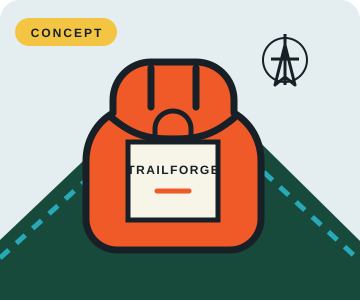

# Explorer archetype: four-hero package

[Home](../README.md) · [Explorer archetype](explorer.md) · [Page templates](../reference/page-templates.md)

> **Concept project:** TrailForge is a fictional brand. The pack illustration is original concept artwork, not a photograph or a claim about an available product. Add product specifications, expert endorsements, customer quotes, or usage figures only when they can be verified.

## The brief

| Element | Direction |
|---|---|
| **Brand** | TrailForge — fictional concept |
| **Product** | An outdoor adventure backpack — concept only |
| **Audience** | Curious people who want the freedom to explore new places |
| **Core offer** | A backpack concept for carrying everyday adventure essentials |
| **Archetype** | Explorer: independent, curious, energetic, and ready to move |
| **Shared CTA** | **Explore the pack** |
| **Modernist style** | Futurism: speed, diagonals, and directional movement |
| **Postmodernist style** | Grunge: layered textures and imperfect, rebellious composition |
| **Persuasion principles** | Authority and Social Proof; evidence required before publication |

The four concepts keep the same brand, audience, product, offer, illustration, and CTA. Only the design treatment and persuasion message change.

## The four heroes

### 1. Futurism × Authority

<table style="width:100%;border-collapse:collapse;"><tr>
<td style="width:58%;vertical-align:middle;padding:12px;">

TrailForge / Find your next line

<h2 style="font-size:40px;line-height:1.02;margin:12px 0;">The map ends. You don't.</h2>

Pack the essentials and follow the route that catches your eye.

<strong>[Add a verified material specification or qualified expert review, with its source.]</strong>

<strong>Explore the pack →</strong>

</td>
<td style="width:42%;text-align:center;padding:12px;">

</td>
</tr></table>

**Why it fits:** “The map ends. You don't.” points toward independence and the next unknown. Sharp angles and a strong directional line echo Futurism; the Authority slot must be filled with verifiable product or expert evidence, not a vague quality claim.

### 2. Grunge × Authority

<table style="width:100%;border-collapse:collapse;"><tr>
<td style="width:58%;vertical-align:middle;padding:12px;">

TrailForge / Field notes 01

<h2 style="font-size:40px;line-height:1.02;margin:12px 0;">Leave the neat route behind.</h2>

Take the essentials. Choose your own way through.

<strong>[Add a verified material specification or qualified expert review, with its source.]</strong>

<strong>Explore the pack →</strong>

</td>
<td style="width:42%;text-align:center;padding:12px;">

</td>
</tr></table>

**Why it fits:** The copy celebrates choosing your own direction without making unsupported promises about the pack. Grunge enters through the rough-edged frame and field-note label; the evidence slot is explicit rather than implying that an expert has already endorsed the concept.

### 3. Futurism × Social Proof

<table style="width:100%;border-collapse:collapse;"><tr>
<td style="width:58%;vertical-align:middle;padding:12px;">

TrailForge / Your next route

<h2 style="font-size:40px;line-height:1.02;margin:12px 0;">Pick a direction. See what opens up.</h2>

Your next trip starts with a place you haven't been.

<strong>[Add a real customer quote or verified user figure only with evidence and permission.]</strong>

<strong>Explore the pack →</strong>

</td>
<td style="width:42%;text-align:center;padding:12px;">

</td>
</tr></table>

**Why it fits:** The headline makes discovery feel active and self-directed. Futurist diagonals suggest forward motion; a real, permissioned customer story could supply Social Proof, but the placeholder is not a testimonial.

### 4. Grunge × Social Proof

<table style="width:100%;border-collapse:collapse;"><tr>
<td style="width:58%;vertical-align:middle;padding:12px;">

TrailForge / Notes from the way out

<h2 style="font-size:40px;line-height:1.02;margin:12px 0;">Not all who wander take the same way.</h2>

Find a fresh path and make the day your own.

<strong>[Add a real customer quote or verified user figure only with evidence and permission.]</strong>

<strong>Explore the pack →</strong>

</td>
<td style="width:42%;text-align:center;padding:12px;">

</td>
</tr></table>

**Why it fits:** The message invites people to find their own route, a strong Explorer cue. A scrapbook-like frame brings in Grunge; publish a Social Proof line here only when it is a genuine, sourced customer statement or figure.

## Compare and choose

**Strongest hero:** Pending visual review. Compare all four for Explorer energy, readability, clarity of offer and CTA, distinct style expression, and credible use of the persuasion principle. The Authority and Social Proof treatments are not publication-ready until their evidence placeholders are replaced with verified material.

## Process notes

**Shared prompt:** Create four static hero concepts for the fictional TrailForge outdoor backpack. Keep the audience, product concept, offer, original backpack illustration, and “Explore the pack” CTA consistent. Pair Futurism with Authority and Social Proof, then pair Grunge with the same two principles. Make the Explorer feel independent, curious, and in motion. Use sharp directional lines for Futurism and layered, imperfect field-note details for Grunge. Keep all text readable. Do not invent product specifications, expert endorsements, customer quotes, usage figures, or other claims.

**Rejected draft:** “The perfect backpack for everyone.”

**Why it was rejected:** It is generic, makes an absolute product claim, and gives no sense of independence or discovery.

**Revision:** “The map ends. You don't.”

The revision is shorter, more active, and gives the Explorer a reason to keep moving.

## Sources and credits

- [The Brand Archetypes, “The Explorer”](https://thebrandarchetypes.com/archetype/the-explorer/): archetype motivation and personality cues.
- [Giacomo Balla, *Dynamism of a Dog on a Leash*, 1912 — Buffalo AKG Art Museum](https://buffaloakg.org/artworks/196416-dinamismo-di-un-cane-al-guinzaglio-dynamism-dog-leash): reference for repeated forms and visual movement. The hero artwork does not reproduce Balla's painting.
- [Giacomo Balla, *Speeding Automobile*, 1912 — The Museum of Modern Art](https://www.moma.org/collection/works/79343): additional Futurist reference.
- [“Ray Gun—The Magazine That Defined the Alt ’90s—Lives Again” — Vogue](https://www.vogue.com/article/ray-gun-magazine-anthology): context for the experimental magazine design associated with Grunge. The hero layouts are original concepts, not copies of *Ray Gun*.
- **Backpack illustration:** original concept artwork created for this exercise; not a product photograph.
