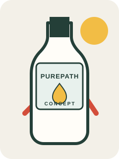

# Innocent archetype: four-hero package

[Home](../README.md) · [Innocent archetype](innocent.md) · [Page templates](../reference/page-templates.md)

> **Concept project:** PurePath is a fictional brand for this exercise. The copy and bottle drawing below are design concepts, not claims about a real product. Add product facts, expert credentials, customer quotes, or usage numbers only after they have been verified and permission has been obtained.

## The brief

| Element | Direction |
|---|---|
| **Brand** | PurePath — fictional concept |
| **Product** | An everyday hydration drink — concept only |
| **Audience** | People looking for a simple drink to fit into an everyday routine |
| **Core offer** | A straightforward drink concept, presented with clarity |
| **Archetype** | Innocent: optimistic, sincere, uncomplicated, and reassuring |
| **Shared CTA** | **Explore PurePath** |
| **Modernist style** | Bauhaus: functional hierarchy and geometric order |
| **Postmodernist style** | Memphis: playful shapes, color, and pattern |
| **Persuasion principles** | Authority and Social Proof, used only with substantiated evidence |

Each concept keeps the same fictional brand, product, audience, offer, and CTA. The original bottle drawing is a visual placeholder, not a photograph or representation of an existing product.

## Hero concepts

### 1. Bauhaus × Authority

<table style="width:100%;border-collapse:collapse;"><tr>
<td style="width:58%;vertical-align:middle;padding:12px;">

PurePath · a drink concept

<h2 style="font-size:36px;line-height:1.05;">A simple drink. A clear label.</h2>

Meet a straightforward hydration concept, designed to make the details easy to find.

<strong>[Add a verified expert review and source before making an authority claim.]</strong>

<strong>Explore PurePath →</strong>

</td>
<td style="width:42%;text-align:center;padding:12px;">

</td>
</tr></table>

**Why it fits:** Plain, reassuring language supports the Innocent archetype. The Bauhaus-inspired grid and restrained geometry put the message first; the authority element is deliberately an evidence placeholder, not an endorsement.

### 2. Memphis × Authority

<table style="width:100%;border-collapse:collapse;"><tr>
<td style="width:58%;vertical-align:middle;padding:12px;">

PurePath · a drink concept

<h2 style="font-size:36px;line-height:1.05;">Good things, clearly said.</h2>

A cheerful everyday drink concept, with the details up front and easy to read.

<strong>[Add a verified expert review and source before making an authority claim.]</strong>

<strong>Explore PurePath →</strong>

</td>
<td style="width:42%;text-align:center;padding:12px;">

</td>
</tr></table>

**Why it fits:** The warm, direct wording stays innocent and approachable. Memphis-inspired color and irregular shapes bring energy; any expert signal remains a clearly marked placeholder until there is verifiable evidence.

### 3. Bauhaus × Social Proof

<table style="width:100%;border-collapse:collapse;"><tr>
<td style="width:58%;vertical-align:middle;padding:12px;">

PurePath · a drink concept

<h2 style="font-size:36px;line-height:1.05;">A simple sip for your day.</h2>

Could PurePath find a place in your everyday routine?

<strong>[Replace with a real customer quote or verified figure only with evidence and permission.]</strong>

<strong>Explore PurePath →</strong>

</td>
<td style="width:42%;text-align:center;padding:12px;">

</td>
</tr></table>

**Why it fits:** A gentle question keeps the tone open rather than pushy. The orderly Bauhaus layout gives a verified testimonial or customer figure a clear place; the bracketed note must be replaced with substantiated material before publication.

### 4. Memphis × Social Proof

<table style="width:100%;border-collapse:collapse;"><tr>
<td style="width:58%;vertical-align:middle;padding:12px;">

PurePath · a drink concept

<h2 style="font-size:36px;line-height:1.05;">Make room for a little refresh.</h2>

A bright, simple drink concept for the small pauses in an ordinary day.

<strong>[Add a real customer quote or verified figure here only with evidence and permission.]</strong>

<strong>Explore PurePath →</strong>

</td>
<td style="width:42%;text-align:center;padding:12px;">

</td>
</tr></table>

**Why it fits:** The language is light and optimistic without promising a health benefit. Memphis-style color and playful geometry make the composition more expressive; the social-proof slot is intentionally empty of invented reviews or popularity claims.

## Process notes

**Shared prompt:** Create four static hero concepts for the fictional PurePath everyday-drink brand. Keep the audience, core offer, product concept, bottle illustration, and “Explore PurePath” CTA consistent. Pair Bauhaus structure with Authority and Social Proof, then pair Memphis color and pattern with the same two principles. Use warm, plain, optimistic language. Treat expert credentials, research, testimonials, customer counts, and product attributes as placeholders unless verified; do not invent evidence.

**Rejected draft:** “The world's healthiest hydration drink.”

**Why it was rejected:** It makes a sweeping health comparison without evidence and does not sound especially simple or sincere.

**Revision:** “A simple drink. A clear label.”

**Strongest concept:** Pending review. Compare the four concepts for readability, Innocent tone, distinct style expression, and whether any evidence-dependent element can be substantiated. Do not select a social-proof or authority treatment for publication until its supporting evidence is available.

## Sources and credits

- [Bauhaus, 1919–1933 — The Metropolitan Museum of Art](https://www.metmuseum.org/essays/the-bauhaus-1919-1933): historical context for the functional, geometric design direction.
- [George Sowden, *Penrose Fruit Bowl*, 1983 — The Metropolitan Museum of Art](https://www.metmuseum.org/art/collection/search/751926): reference for the Memphis-related playful, object-led visual direction. The hero concepts are not reproductions of this work.
- [Federal Trade Commission, Endorsements, Influencers, and Reviews](https://www.ftc.gov/business-guidance/advertising-marketing/endorsements-influencers-reviews): guidance for truthful, properly supported endorsements and reviews.
- [Influence at Work, “The 7 Principles of Persuasion”](https://www.influenceatwork.com/7-principles-of-persuasion/): overview of Authority and Social Proof as persuasion principles.
- **Bottle illustration:** original concept artwork created for this exercise; it is not a product photograph.
