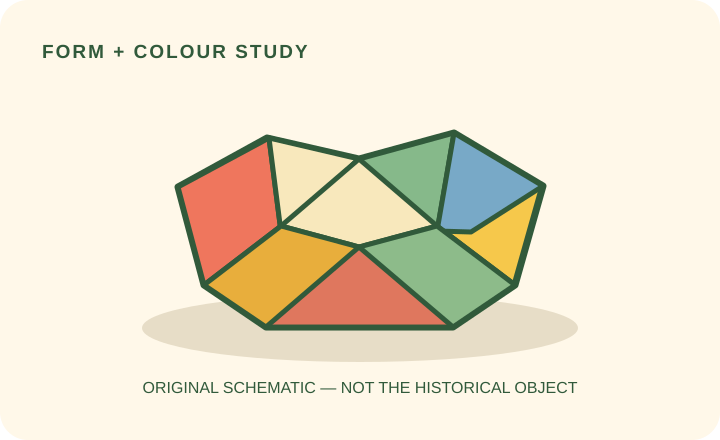

# Innocent Archetype
[Home](../README.md)

## What it is

The Innocent archetype sees the sunny side, likes things simple, and wants people to feel in safe hands. Its voice is warm, honest, and reassuring—more friendly chat than grand announcement. It makes the good stuff easy to understand, with no fuss and no hard sell.

## A real brand reference: innocent drinks

Innocent Drinks is a useful real-world reference for this kind of cheerful, down-to-earth personality. Have a look at the packs below: the fruit and drink are easy to spot, the colors feel fresh, and the little details bring a human touch. Borrow the principles—not the brand's exact words, artwork, or logo.

*Example product photograph by Mx. Granger, shared under CC0. [Image details and license](https://commons.wikimedia.org/wiki/File:Innocent_Smoothie.jpg).*

*Example product photograph by Mx. Granger, shared under CC0. [Image details and license](https://commons.wikimedia.org/wiki/File:Innocent_Bubbles_1.jpg).*

Fancy another look? Visit the [official Innocent Drinks website](https://www.innocentdrinks.co.uk/) for current examples. The packaging and brand assets belong to their owners; these pictures are here for study, so make your own original work.

## Audience and purpose

This archetype may suit people who like things clear, dependable, and positive. It helps a brand feel welcoming rather than complicated or intimidating—like a helpful friend who explains things plainly and means what they say.

## Recognize and apply it

### Key characteristics

- A hopeful outlook (without pretending everything is perfect)
- Plain, friendly words that get to the point
- Cheerful, welcoming pictures and colors
- Reassurance built on honesty, trust, and care

### Let the words lead the design

Give your headline room to breathe. Keep it short, kind, and easy to read; use everyday words and, if it fits, a tiny wink of gentle humor. No shouting and no promises you can't keep. Let one bright picture or a few little fruit doodles join in without talking over the message.

For a friendly, Innocent-inspired feel, try [**Mali**](https://fonts.google.com/specimen/Mali) for a short, handwritten-style headline and [**Nunito**](https://fonts.google.com/specimen/Nunito) for the supporting words and buttons. Use the playful face for a little personality, not every paragraph; keep small text easy to read. These are friendly alternatives, not a claim about Innocent's actual typeface. And let its wordmark be its own.

**A little original example (not Innocent copy):**

> **Fancy a brighter afternoon?**  
> A little fruit, a lovely taste, and a small lift for your day.  
> **Find your fruity favourite**

Try the headline in the rounded display face, then keep the supporting line plain and clear. Make the button easy to spot. A soft white or cream background, a fresh green accent, and one colorful fruit picture are quite enough to make the whole thing feel sunny.

## Design styles

### Design references

These two historical objects have rather different personalities. Look at how each uses shape and color, then borrow one small idea for your own design. They are design references—not Innocent brand examples.

#### Marcel Breuer — *“Wassily” Armchair* (1925–1926)

Look at that open frame: it feels light, tidy, and carefully put together. For a Bauhaus-inspired hero, try a simple grid and give your headline some breathing room. [See the object record at The Met](https://www.metmuseum.org/art/collection/search/485067).

#### George Sowden — *Penrose Fruit Bowl* (1983)

Here is our own little shape study—not a picture of Sowden's actual bowl. Its bright panels and playful facets show one way Memphis-inspired shapes could bring a little bounce to a design. [See the real object at The Met](https://www.metmuseum.org/art/collection/search/751926); the collection record does not provide an image for reuse.

### Bauhaus

Bauhaus brings a tidy, practical side to the Innocent archetype. Simple shapes, clear type, and an uncluttered layout help the message feel easy and trustworthy. Everything has a place; nothing needs to shout.

### Memphis

Memphis design arrived in the early 1980s with bright colors, unexpected shapes, and a playful mix of patterns and materials. A little of that cheerful energy can suit the Innocent archetype too—just keep the words clear and the decoration in good company.

## How I would use these styles in a hero

For a **Bauhaus-inspired** hero, I'd start with a short, sunny headline, line everything up neatly, and add one or two simple fruit shapes. A little green and cream would keep the page calm and clear.

For a **Memphis-inspired** hero, I'd keep those same clear words and button, then invite a few lively fruit colors or playful shapes around the edges. The decorations can have fun, as long as the message stays easy to read.

Whichever way you go, use a real product photo only when you have permission—or draw your own little picture. Let the words, image, and button get along. If the decorations are stealing the show, it's time for a gentle tidy-up.

## Sources

- [Innocent Drinks, official website](https://www.innocentdrinks.co.uk/) — current brand reference; visual observations are design analysis, not official brand guidelines.
- [Innocent Smoothie, Wikimedia Commons](https://commons.wikimedia.org/wiki/File:Innocent_Smoothie.jpg) — product photograph by Mx. Granger, CC0.
- [Innocent Bubbles 1, Wikimedia Commons](https://commons.wikimedia.org/wiki/File:Innocent_Bubbles_1.jpg) — product photograph by Mx. Granger, CC0.
- [Marcel Breuer, “Wassily” Armchair, The Met](https://www.metmuseum.org/art/collection/search/485067) — historical object reference; image from Wikimedia Commons.
- [George Sowden, “Penrose Fruit Bowl,” The Met](https://www.metmuseum.org/art/collection/search/751926) — historical object reference; accompanying schematic is an original study, not a reproduction.
- The Metropolitan Museum of Art, “Ettore Sottsass: Exhibition Galleries” — https://www.metmuseum.org/exhibitions/listings/2017/ettore-sottsass
- The Metropolitan Museum of Art, “George Sowden — Penrose Fruit Bowl” — https://www.metmuseum.org/art/collection/search/751926
- The Brand Archetypes, “The Innocent” — https://thebrandarchetypes.com/archetype/the-innocent/